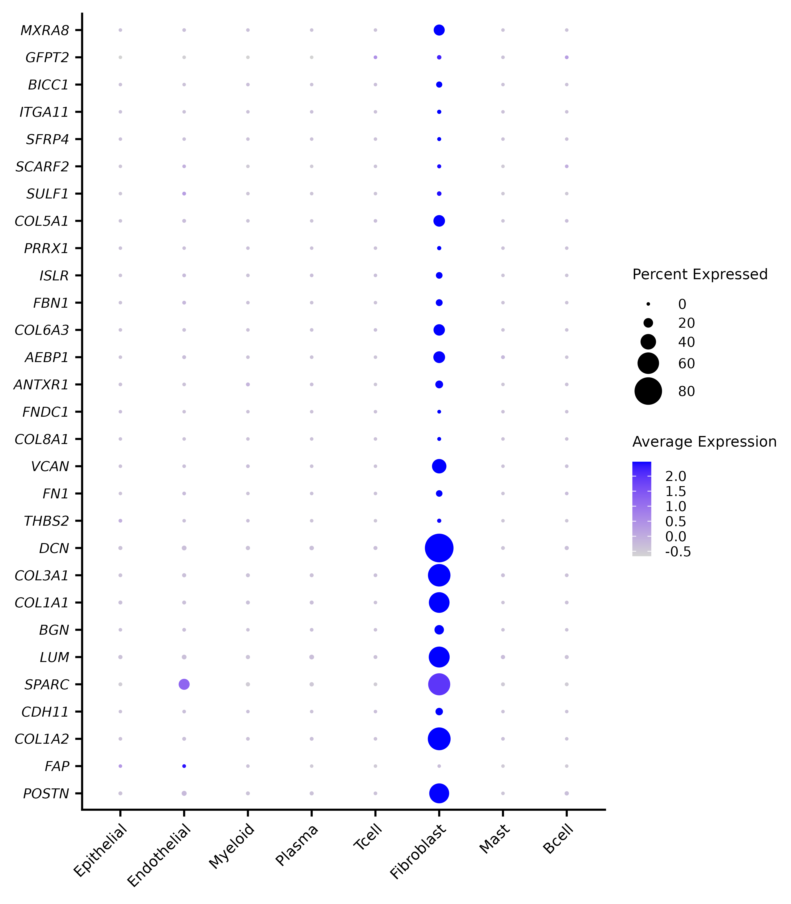
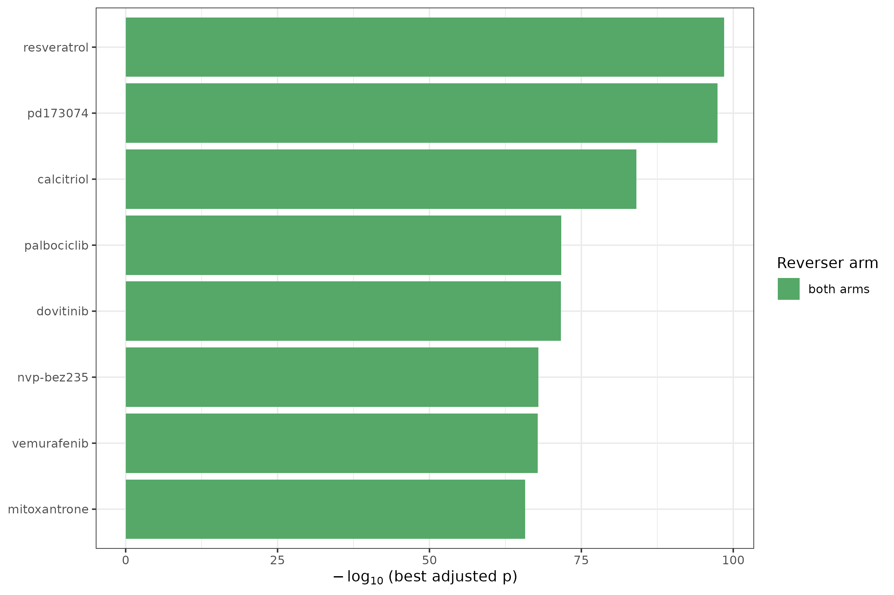
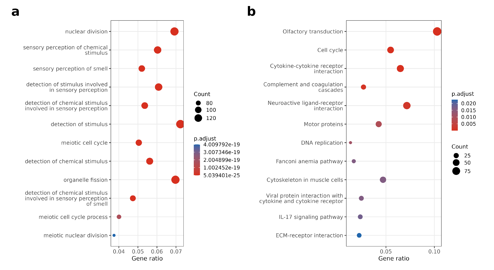
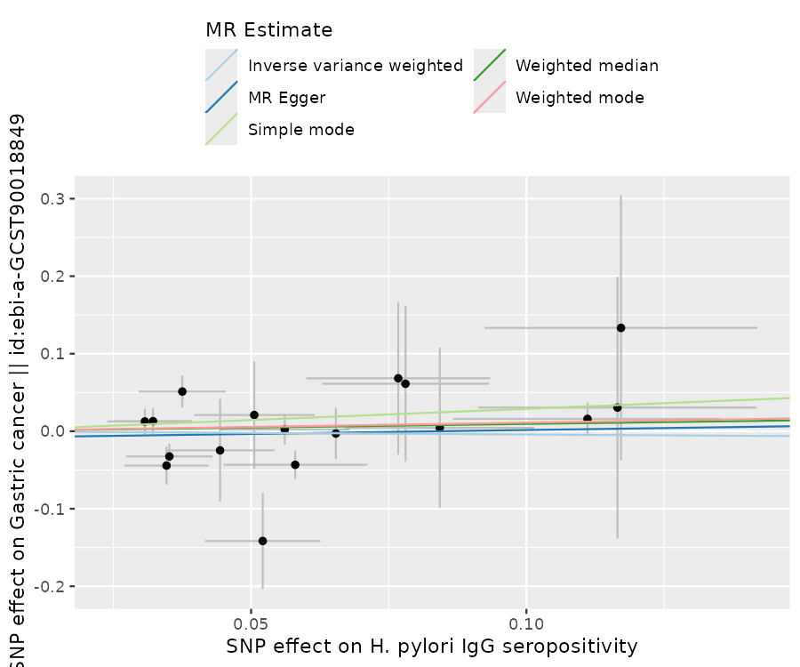
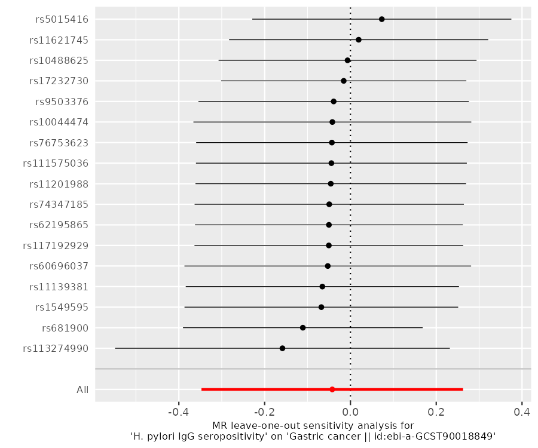
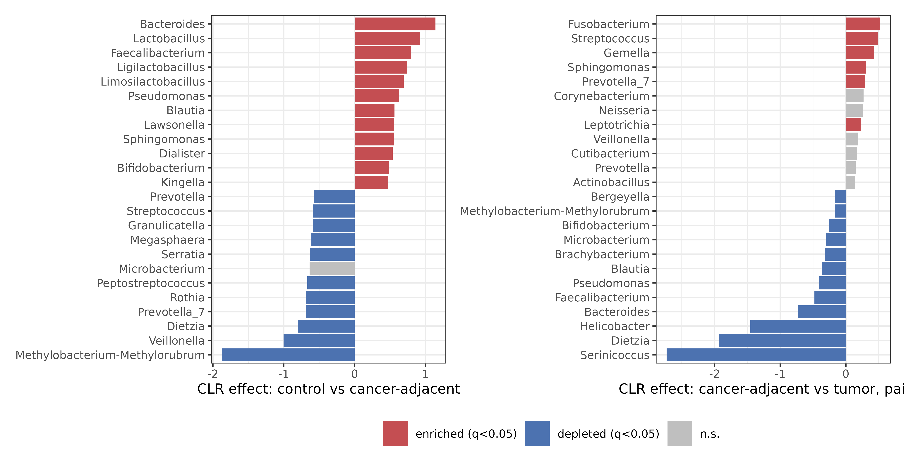
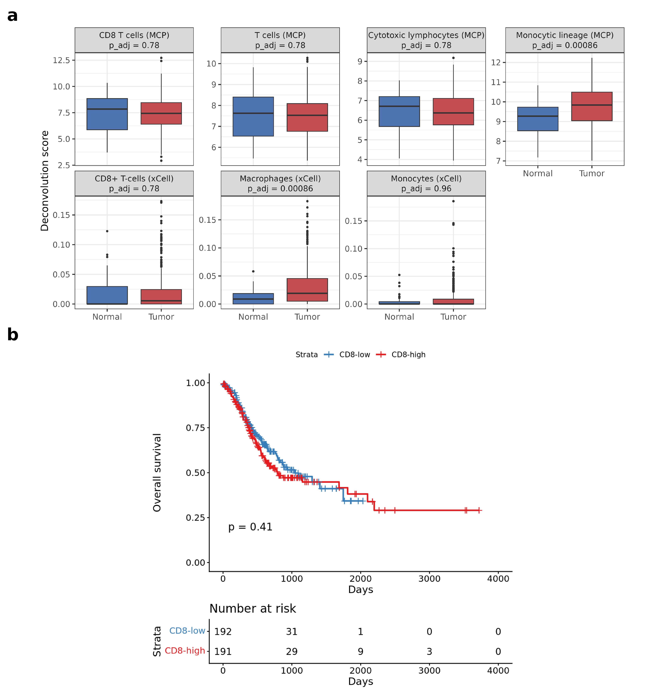
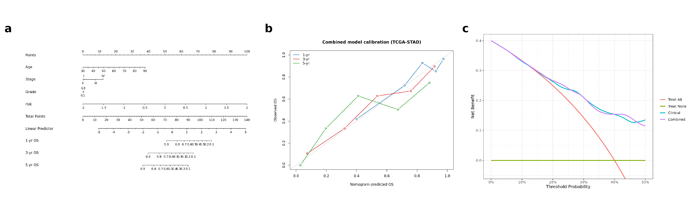
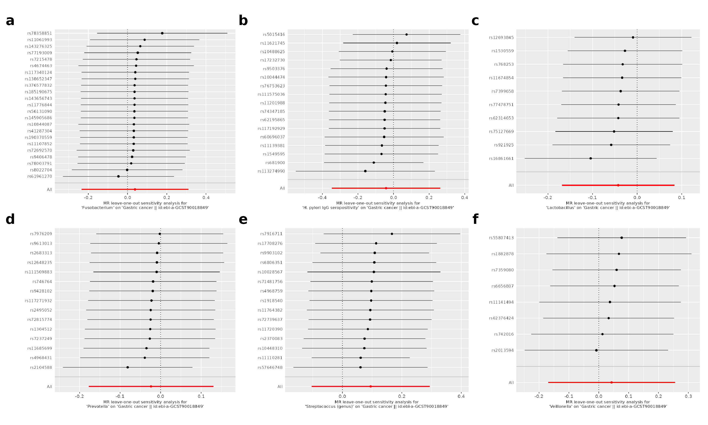

# Supplementary Material

*Note: Supplementary Tables S3 (TRIPOD checklist) and S7 (data-acquisition & reproducibility checklist) are provided as separate files; their legends appear here for completeness. Supplementary Tables S1, S2, S4, S5 and S6 are tabulated below.*

## Supplementary Tables

**Supplementary Table S1. Per-exposure Mendelian-randomisation instruments.** Instrument count, F-statistics, and inverse-variance-weighted estimates for each microbial exposure.

| Exposure | p_threshold | nSNP_prclump | nSNP_used | mean_F | min_F | IVW_OR | IVW_CI | IVW_p | PRESSO_global_p |
|---|---|---|---|---|---|---|---|---|---|
| H. pylori IgG seropositivity | 5e-8 -> 1e-5 (locus-wide) | 21 | 17 | 21.6 | 19.7 | 0.96 | 0.71-1.30 | 0.79 | 0.052 |
| Streptococcus (genus) | 5e-8 -> 1e-5 (locus-wide) | 17 | 15 | 22.5 | 19.3 | 1.1 | 0.90-1.34 | 0.35 | 0.159 |
| Fusobacterium | 5e-8 -> 1e-5 (locus-wide) | 25 | 23 | 22.8 | 19.6 | 1.04 | 0.79-1.36 | 0.79 | 0.611 |
| Prevotella | 5e-8 -> 1e-5 (locus-wide) | 19 | 15 | 20.9 | 19.4 | 0.98 | 0.84-1.14 | 0.76 | 0.605 |
| Veillonella | 5e-8 -> 1e-5 (locus-wide) | 11 | 8 | 21.2 | 19.9 | 1.04 | 0.84-1.29 | 0.69 | 0.676 |
| Lactobacillus | 5e-8 -> 1e-5 (locus-wide) | 12 | 10 | 22.1 | 20.3 | 0.96 | 0.84-1.09 | 0.51 | 0.542 |

**Supplementary Table S2. MR-PRESSO global tests.** Horizontal-pleiotropy global test per exposure.

| exposure | RSSobs | PRESSO_global_p |
|---|---|---|
| H. pylori IgG seropositivity | 32.6 | 0.052 |
| Streptococcus (genus) | 23.1 | 0.159 |
| Lactobacillus | 10.3 | 0.542 |
| Prevotella | 14 | 0.605 |
| Fusobacterium | 21.8 | 0.611 |
| Veillonella | 6.39 | 0.676 |

**Supplementary Table S3. TRIPOD checklist.** Item-by-item reporting location (provided as separate TRIPOD_checklist file).

**Supplementary Table S4. Alpha-diversity effect sizes.** Cliff's delta and Wilcoxon p for Observed/Shannon/Simpson across the disease cascade.

| metric | median_Nonul | median_GCN | cliffs_delta | wilcox_p |
|---|---|---|---|---|
| Observed | 47 | 30 | -0.27 | 3.3e-07 |
| Shannon | 2.18 | 1.92 | -0.122 | 0.0211 |
| Simpson | 0.781 | 0.756 | -0.072 | 0.172 |

**Supplementary Table S5. Non-circular single-cell localisation.** Dominant cell type per stromal hub gene, excluding cluster-annotation markers.

| gene | dominant_cell_type | frac_in_dominant | panel |
|---|---|---|---|
| ANTXR1 | Fibroblast | 0.863 | stromal_hub |
| COL6A3 | Fibroblast | 0.977 | stromal_hub |
| SPARC | Fibroblast | 0.653 | stromal_hub |
| POSTN | Fibroblast | 0.973 | stromal_hub |
| MXRA8 | Fibroblast | 0.98 | stromal_hub |
| FN1 | Fibroblast | 0.914 | stromal_hub |
| COL8A1 | Fibroblast | 0.998 | stromal_hub |
| VCAN | Fibroblast | 0.972 | stromal_hub |
| GFPT2 | Fibroblast | 0.527 | stromal_hub |
| THBS2 | Fibroblast | 0.82 | stromal_hub |
| AEBP1 | Fibroblast | 0.924 | stromal_hub |
| BGN | Fibroblast | 0.972 | stromal_hub |
| SULF1 | Fibroblast | 0.773 | stromal_hub |
| COL5A1 | Fibroblast | 0.937 | stromal_hub |
| BICC1 | Fibroblast | 0.97 | stromal_hub |
| FBN1 | Fibroblast | 0.932 | stromal_hub |
| ISLR | Fibroblast | 0.902 | stromal_hub |
| CDH11 | Fibroblast | 0.96 | stromal_hub |
| SFRP4 | Fibroblast | 0.987 | stromal_hub |
| SCARF2 | Fibroblast | 0.736 | stromal_hub |
| PRRX1 | Fibroblast | 0.979 | stromal_hub |
| FNDC1 | Fibroblast | 0.983 | stromal_hub |
| ITGA11 | Fibroblast | 0.984 | stromal_hub |

**Supplementary Table S6. GSE84437 pT-stage-stratified validation.** Signature discrimination within pT-stage strata.

| subset | n | events | C | C_se | HR_perSD | CI | p | C_below_0.5 |
|---|---|---|---|---|---|---|---|---|
| All (T1-T4) | 431 | 207 | 0.465 | 0.021 | 1.14 | 1.00-1.29 | 0.0512 | True |
| Early (T1-T3) | 141 | 47 | 0.444 | 0.046 | 1.21 | 0.96-1.54 | 0.108 | True |
| Late (T4) | 290 | 160 | 0.483 | 0.024 | 1.09 | 0.93-1.27 | 0.29 | True |
| T2-T3 only | 130 | 45 | 0.442 | 0.047 | 1.23 | 0.96-1.56 | 0.0978 | True |

**Supplementary Table S7. Data-acquisition & reproducibility checklist.** Accessions, tools, versions, script-to-result mapping (see manuscript Appendix and PIPELINE file).

**Supplementary Table S8. WGCNA soft-thresholding power sensitivity.** Scale-free fit, mean connectivity, module count, CAF-module eigengene hazard ratio (95% CI) and Cox P, and hub-gene co-membership fraction at powers 3, 6, 9 and 12. Supports Figure 5(c).

File: `results/wgcna_real/power_robustness_summary.csv`.

## Supplementary Figures

**Supplementary Figure S1. Single-cell atlas (GSE134520).** UMAP of 43,992 cells from the premalignant-to-early-gastric-cancer cascade, coloured by the eight annotated major cell types (Epithelial 68.6%, Endothelial 7.6%, Myeloid 6.4%, Plasma 5.8%, T-cell 5.8%, Fibroblast 4.2%, Mast 1.0%, B-cell 0.6%). Provides the cellular reference underlying the module-localisation analysis (Figure 3C, §3.10). File: `results/scrna/UMAP_celltypes.png`.

**Supplementary Figure S2. Stromal hub-gene expression by cell type.** Dot plot of prognostic WGCNA red-module hub genes across the eight cell types (dot size = fraction of cells expressing; colour = scaled mean expression). Hub-gene expression is confined to the fibroblast compartment, providing the direct visual basis for the non-circular localisation result (all 23/23 non-annotation hub genes fibroblast-dominant; §3.10, Supplementary Table S5). File: `results/scrna/DotPlot_stromal_module_hub.png`.

**Supplementary Figure S3. In-silico drug-repurposing candidates.** Top compounds whose transcriptional perturbation signature reverses the tumour-up/tumour-down programme on both arms (Enrichr against LINCS L1000 and GEO drug-perturbation libraries), ranked by combined score. Nominated classes are dominated by PI3K/mTOR (NVP-BEZ235), CDK4/6 (palbociclib) and FGFR/multikinase (PD-173074, dovitinib) inhibitors — anti-proliferative agents concordant with the proliferation-dominated signature. Hypothesis-generating only; no experimental validation (§3.11). File: `results/drug_repurposing_integrated/top_candidate_drugs.png`.

**Supplementary Figure S4. Over-representation analysis (GO:BP and KEGG, tumour-up genes).** clusterProfiler ORA dot plots for the tumour-up gene set (dot size = gene count; colour = adjusted p). Cell-cycle/nuclear-division and ECM-receptor/cytokine terms dominate, concordant with the proliferation and stromal programmes. Note that ORA depends on the significance threshold and is sensitive to gene-family size — the prominent "olfactory/sensory-perception" terms reflect the large olfactory-receptor family rather than tumour biology; the threshold-free GSEA in Figure 1 is therefore the primary enrichment method, with ORA shown for completeness (§3.2). Files: `results/enrichment/dotplot_GO_BP_UP.png`, `results/enrichment/dotplot_KEGG_UP.png`.

**Supplementary Figure S5. Mendelian-randomisation scatter (representative exposure).** SNP-exposure vs SNP-outcome effects for anti-*H. pylori* IgG seropositivity on gastric cancer, with the five MR method slopes overlaid (IVW, MR-Egger, weighted median, weighted mode, simple mode). All slopes are flat and indistinguishable from zero (IVW OR 0.96, 0.71–1.30; §3.9). Analogous plots for all six exposures in both ancestries are in `results/mr_real/` and `results/mr_real_eas/`. File: `results/mr_real/scatter_H__pylori_IgG_seropositivity.png`.

**Supplementary Figure S6. Mendelian-randomisation leave-one-out (representative exposure).** Leave-one-out IVW estimates for anti-*H. pylori* IgG seropositivity: removing any single SNP leaves the pooled estimate straddling the null, confirming no individual instrument drives the result (§3.9). File: `results/mr_real/loo_H__pylori_IgG_seropositivity.png`.

**Supplementary Figure S7. Tissue-microbiome compositional differential abundance.** Centred-log-ratio (CLR) effect sizes for the two discovery-cohort contrasts (Wilcoxon, Benjamini–Hochberg): (left) control vs cancer-adjacent mucosa (44/61 genera q<0.05) and (right) paired cancer-adjacent vs tumour (18/61 genera q<0.05). Bars coloured by direction where q<0.05 (red enriched, blue depleted, grey n.s.); the twelve most enriched and depleted genera are shown per panel. These genus-level shifts are reported for completeness but, as detailed in §3.8, are confounded with sequencing batch in the tumour contrast and do not replicate in the independent batch-clean cohort, so they are not proposed as biomarkers. Files: `results/microbiome_biomarker/04a_DA_control_vs_GCN.csv`, `04b_DA_GCN_vs_GCT_paired.csv`.

**Supplementary Figure S8. Immune infiltration, deconvolution validated against pathology.** (A) Deconvolution T-cell score versus the measured histological leukocyte fraction (Spearman ρ=0.67, p=3.6×10⁻³⁶), establishing that the expression-based estimates track true tissue composition. (B) Immune compartments, tumour versus normal — enrichment is dominated by the macrophage/monocyte lineage, with no net CD8⁺ gain. (C) Infiltration by molecular subtype (EBV most infiltrated, CIN least; Kruskal–Wallis p<10⁻⁶). (D) CD8⁺ score versus overall survival — not prognostic in this cohort (Cox HR 1.04, p=0.41), reported as observed (§3.3). Files: `results/plots/Immune_*.png`.

**Supplementary Figure S9. Clinical nomogram, calibration and external decision-curve analysis.** (A) Combined clinical+signature nomogram for 1/3/5-year overall survival. (B) Calibration at 1/3/5 years (in-sample). (C) External decision-curve analysis in ACRG: both the clinical and the combined models carry net benefit over treat-all/treat-none, but their curves are essentially superimposed across the 5–40% threshold range, i.e. adding the signature confers no *incremental* net benefit over standard staging out-of-sample (§3.7). The nomogram is presented as an illustrative research tool, not a validated decision instrument. Files: `results/nomogram_combined/`, `results/external_utility_ACRG/DCA_external.png`.

**Supplementary Figure S10. Mendelian-randomisation leave-one-out — all six exposures.** Leave-one-out IVW estimates for each exposure: removing any single SNP leaves every pooled estimate straddling the null, confirming that no individual instrument drives any result and that the null is not an outlier artefact (§3.9). Files: `results/mr_real/loo_*.png`.

**Supplementary Figure S11. The tumour-microbiome classifier is a batch artefact.** (A) Top fifteen genera ranked by mean decrease in Gini importance in the cancer-versus-control random forest; genera in red italic are environmental or skin contaminants (*Dietzia*, *Serinicoccus*, *Methylobacterium–Methylorubrum*, *Microbacterium*, *Sphingomonas*, *Serratia*), not gut or oral commensals, and dominate the classifier. (B) The classifier's apparent discrimination (cancer-versus-control AUC 0.92, 95% CI 0.90–0.94) is not biological: the same feature space predicts the sequencing flowcell among biologically-similar samples at 78% accuracy versus a 55% majority baseline (dotted line = chance). The apparent tumour signal therefore tracks sequencing batch rather than tumour biology (§3.8). Files: `results/microbiome_biomarker/05_rf_importance.csv`, `05_rf_metrics_and_batch_sanity.csv`.
