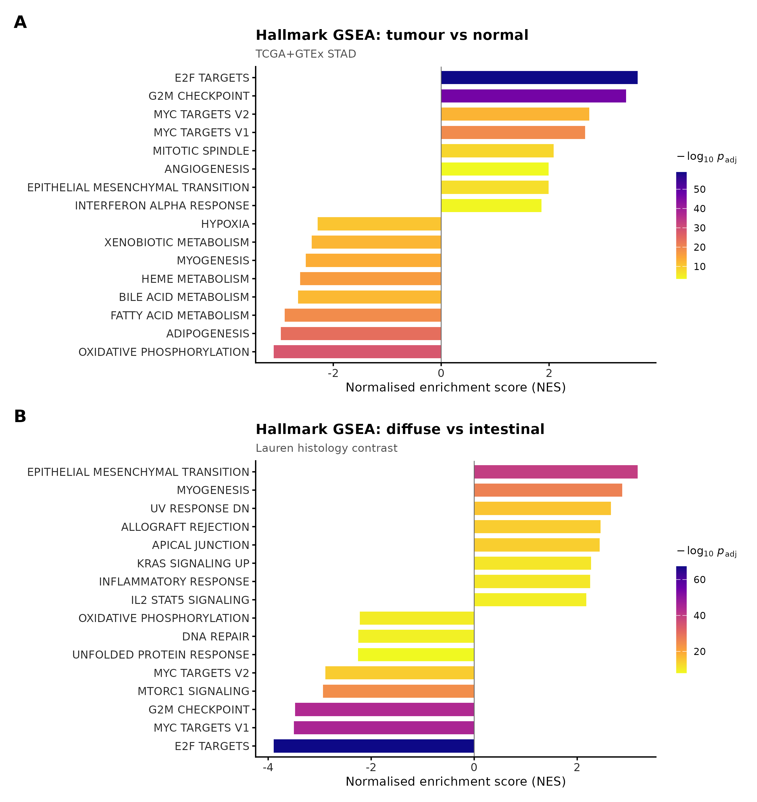
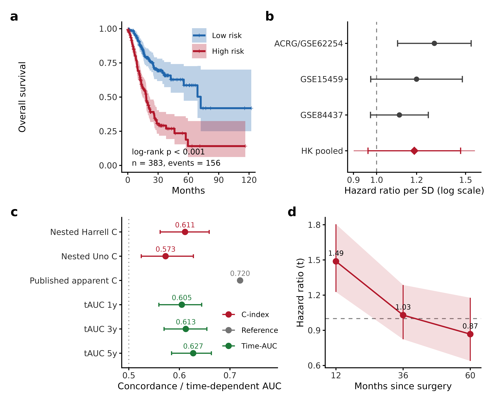
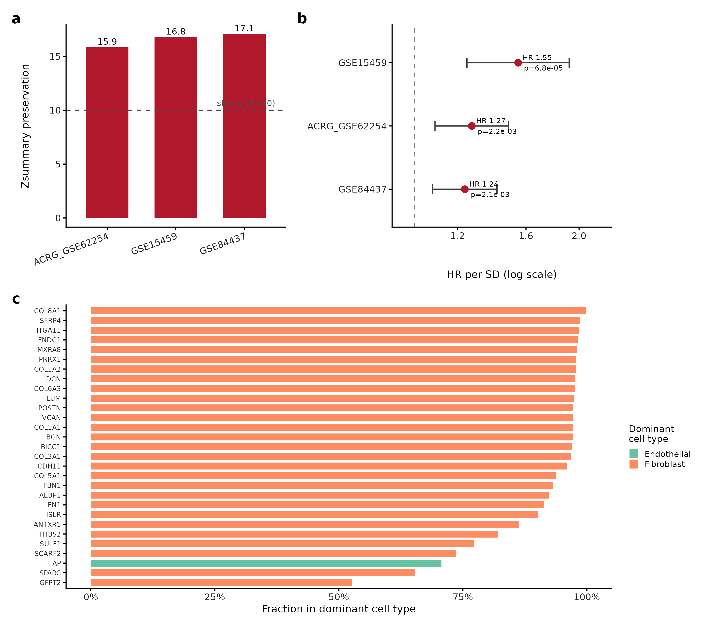
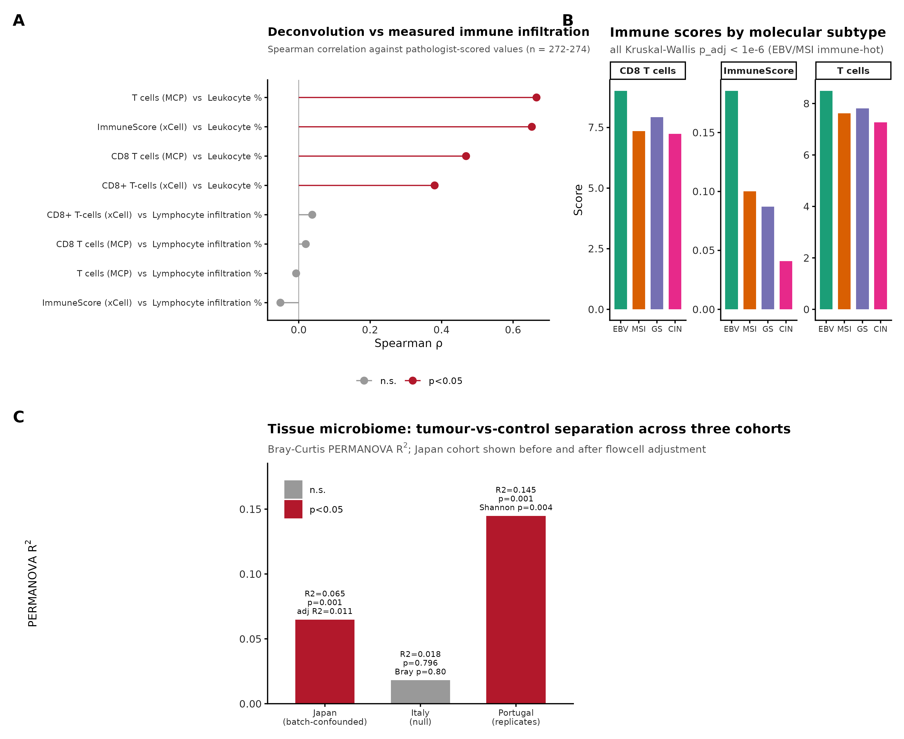
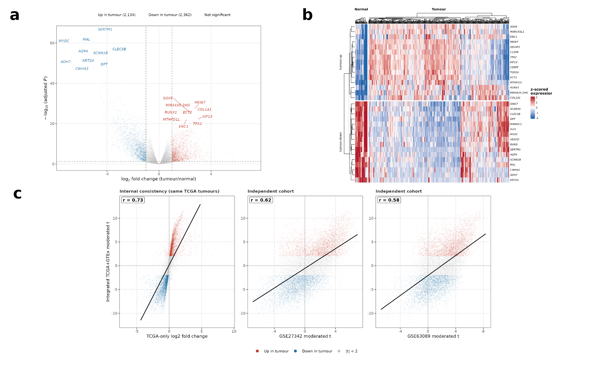
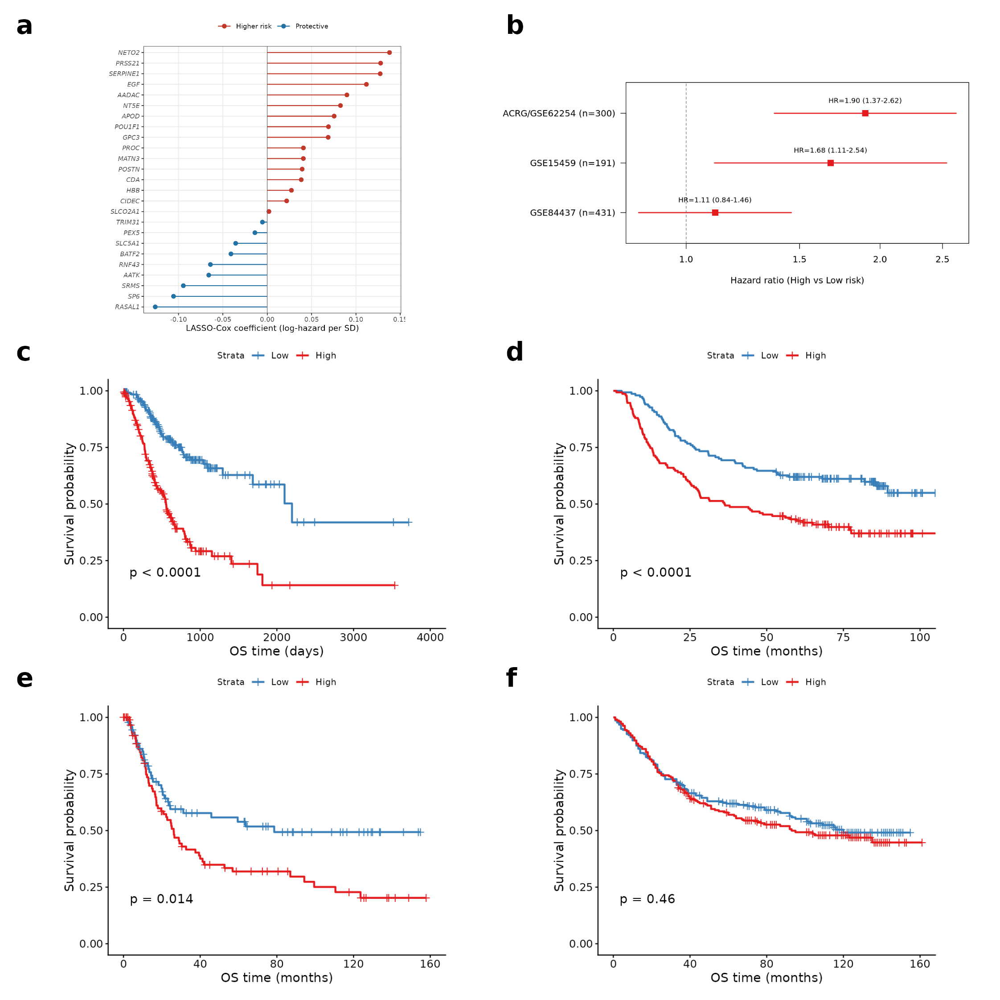
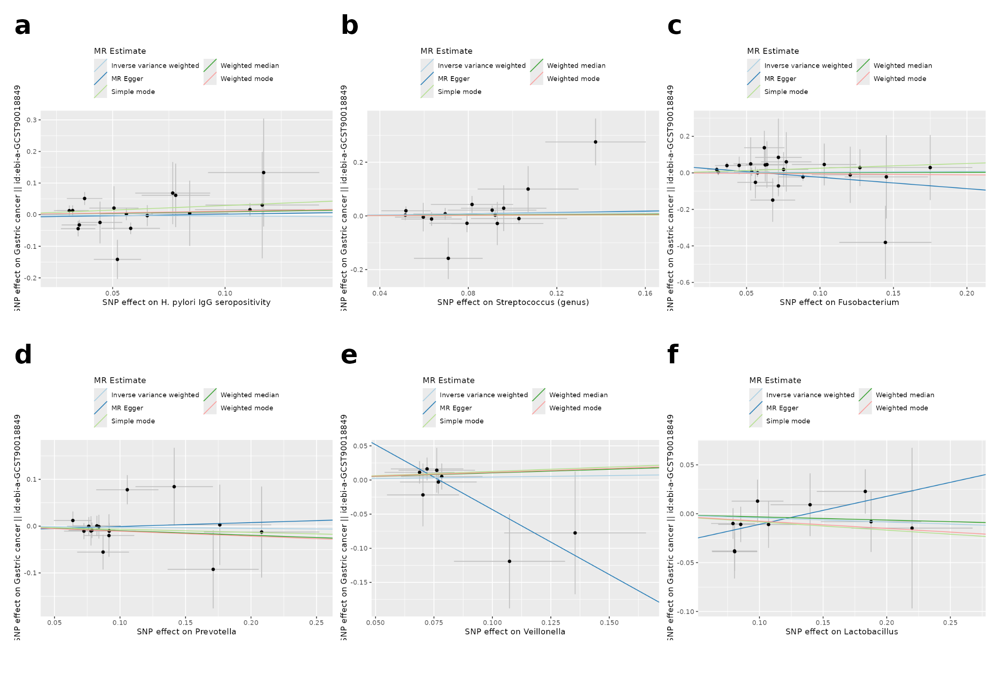

# A multi-omics analysis of gastric cancer identifies an externally-validated stromal/fibroblast prognostic programme, with cautionary tumour-microbiome and Mendelian-randomisation assessments

## Abstract

**Background:** Prognostic stratification of gastric cancer beyond tumour–node–metastasis stage remains limited, and tumour-microbiome "dysbiosis" is frequently claimed without genetic or batch-controlled evidence. We identified and externally validated the transcriptional biology underlying gastric-cancer prognosis and tested, rather than assumed, whether microbial exposures causally influence risk.

**Methods:** We integrated The Cancer Genome Atlas and Genotype-Tissue Expression differential expression (412 tumours versus 443 normal references) and trained a LASSO-Cox prognostic signature on The Cancer Genome Atlas, validating it in three independent cohorts (GSE62254/ACRG, GSE15459, GSE84437; n = 922). We applied gene-set enrichment, immune deconvolution validated against measured leukocyte fraction, weighted gene co-expression network analysis with external module-preservation testing, single-cell localisation (43,992 cells), two-sample Mendelian randomisation of anti-*Helicobacter pylori* seropositivity and five gut genera, and a batch-controlled tissue-16S analysis.

**Results:** A 25-gene signature showed leakage-free nested cross-validation concordance C = 0.61 (apparent 0.72) and validated in two of three cohorts, though a Hartung–Knapp meta-analysis was non-significant (pooled hazard ratio 1.19, 95% confidence interval 0.96–1.47). The signal converged on a stromal/cancer-associated-fibroblast programme localised to fibroblasts and strongly preserved across three external cohorts (module-preservation Zsummary 15.9–17.1; eigengene hazard ratio per standard deviation 1.24–1.55, all p < 0.005). Adding the signature to stage gave negligible decision-curve benefit (ΔC +0.005). The tumour-microbiome signal was a sequencing-batch artefact (flowcell-predictable at 78% versus 55% baseline) and did not replicate in a batch-clean cohort; Mendelian randomisation detected no causal microbial effect on gastric-cancer risk.

**Conclusion:** Gastric-cancer prognosis reflects an externally-replicated stromal/cancer-associated-fibroblast programme that adds little value beyond stage and is not cleanly separable from it; the microbiome associations are observational, not causal.

**Keywords:** gastric cancer; multi-omics; cancer-associated fibroblasts; prognostic signature; Mendelian randomisation; external validation

## Introduction

Gastric cancer (GC) remains the fifth most common malignancy and a leading cause of cancer mortality worldwide, with marked histological and molecular heterogeneity (Lauren intestinal/diffuse classes; TCGA EBV/MSI/GS/CIN subtypes). Two biological axes dominate current mechanistic thinking: (i) host transcriptomic reprogramming driving proliferation, epithelial–mesenchymal transition (EMT) and immune evasion, and (ii) dysbiosis of the gastric and gut microbiome, classically initiated by *Helicobacter pylori*. A recurring weakness in the microbiome-cancer literature is the conflation of **association** with **causation**: taxa that differ between tumour and normal tissue are frequently described as drivers without formal causal testing.

This study is organised around a **single primary question — what transcriptomic biology underlies GC prognosis** — with the microbiome and causal analyses as a clearly-secondary, exploratory arm. In the **primary** analysis, converging bulk co-expression, an externally-validated prognostic signature and single-cell localisation identify a **stromal / cancer-associated-fibroblast programme** as the biology underlying prognosis, while we show candidly that the derived gene signature, though independently prognostic, adds little decision value beyond stage; we also characterise the tumour immune microenvironment using deconvolution **validated against measured histological leukocyte fraction**. **Secondarily and exploratorily**, we characterise the tumour-tissue microbiome with **compositionally-aware** statistics and formally test microbial causality by two-sample **Mendelian randomisation** — addressing the field's recurrent conflation of association with causation — reporting a **null** result transparently. Throughout we distinguish findings from the limits of the data and scope every claim to the evidence that supports it.

## Materials and Methods

### Data sources
- **TCGA-STAD** (host transcriptome): 448 samples (412 primary tumour, 36 solid-tissue normal); STAR gene counts, GENCODE v36; full clinical/molecular annotation (Lauren class, AJCC stage, grade, TCGA molecular subtype, driver mutations, tumour mutational burden [TMB], measured leukocyte/lymphocyte percentage, overall survival).
- **GTEx v10 stomach** (normal reference): 407 samples, TPM.
- **GEO cohorts**: GSE27342, GSE63089 (differential-expression support); **GSE62254 (ACRG, n=300)**, **GSE15459 (n=191)**, **GSE84437 (n=431)** as independent survival-validation cohorts.
- **Tissue microbiome (discovery)**: PRJDB20660 (Japan) 16S rRNA (V3–V4) — all **944 libraries reprocessed from raw FASTQ** through DADA2 to a genuine ASV table (897 samples × 314 genera after host/off-target removal); cohort spans the gastric-cancer sequence (299 non-ulcer, 103 ulcer, 219 cancer-adjacent, 323 tumour).
- **Tissue microbiome (validation)**: PRJNA641258 (Italy) 16S rRNA (V3–V4) — 40 gastric biopsies (20 cancer / 20 matched control), sequenced batch-balanced, processed through the identical pipeline.
- **GWAS summary statistics (IEU OpenGWAS)** for MR — see §2.7.

### Differential expression and cross-cohort concordance
Host differential expression used the **integrated (ComBat-harmonised) TCGA + GTEx transcriptome**, contrasting TCGA tumours (n=412) against a combined normal reference of TCGA solid-tissue normal (n=36) plus GTEx normal stomach (n=407) — i.e. **412 tumour vs 443 normal** — with limma and a cohort covariate (`~ sample_type + dataset`). Because the harmonised matrix is scale-standardised, significance was assessed by adjusted p (BH) and genes were ranked by the moderated t-statistic for downstream enrichment. The two GEO tumour/normal cohorts (GSE27342, GSE63089) were **co-harmonised within the same phenotype-protected ComBat model** and used as a within-cohort tumour-vs-normal concordance check — not a fully independent hold-out, since the harmonisation model included these samples. Because GTEx contributes only normal samples, batch and biology are partially confounded; the cohort covariate and TCGA's own within-cohort tumour/normal contrast mitigate this, and within-cohort concordance in the GEO cohorts (below) is consistent with a biological rather than batch-driven signal — a supportive check, given the co-harmonisation, rather than strictly independent validation. Lauren diffuse-vs-intestinal DE was computed within TCGA tumours.

### Functional enrichment
Over-representation (clusterProfiler: GO BP/MF/CC, KEGG) and gene-set enrichment (fgsea against MSigDB Hallmark and C2:CP) were run on the ranked DE statistics for tumour-vs-normal and diffuse-vs-intestinal contrasts.

### Immune deconvolution
MCP-counter and xCell were applied to the TCGA expression matrix. Deconvolution validity was assessed by Spearman correlation of estimated lymphocyte/immune scores against the **measured** histological leukocyte percentage. Immune scores were compared across tumour/normal, Lauren class and molecular subtype, and tested for association with overall survival.

### Prognostic signature (LASSO-Cox) and external validation
Candidate genes were restricted to those measured across the validation cohorts. Univariable Cox screening (p<0.05) preceded LASSO-Cox (`cv.glmnet`, family="cox") on TCGA tumours, yielding a 25-gene signature. Risk scores (Σ coef·z(expression), standardised within each cohort) were median-split; discrimination was assessed by Harrell's C-index and Kaplan–Meier log-rank tests in TCGA and in each external cohort (GSE62254/ACRG n=300, GSE15459 n=191, GSE84437 n=431; total n=922; overall survival endpoint, complete cases), with multivariable Cox adjustment for stage and age. To obtain a leakage-free performance estimate, the entire pipeline — univariable screen, LASSO tuning and coefficient fitting — was re-run inside a nested cross-validation (outer 5-fold, inner tuning by `cv.glmnet`), so that no gene selection or hyperparameter choice ever saw its own test fold; the nested-CV C-index (0.61), not the apparent full-data C (0.72), is reported as the honest discrimination. External-cohort effect sizes were additionally pooled by a Hartung–Knapp random-effects meta-analysis (metafor).

### Co-expression network (WGCNA)
Weighted gene co-expression network analysis used the 5,000 most variable genes (signed-hybrid network, biweight midcorrelation). The soft-thresholding power was chosen as the lowest value achieving scale-free topology fit R²≥0.85 (no forced fallback). Modules were detected with blockwiseModules (minModuleSize 30, deepSplit 2, mergeCutHeight 0.25); module eigengenes were correlated with clinical and immune traits, and each was tested against overall survival (Cox). For the survival-associated module, hub genes were ranked by module membership (MM) and gene significance (GS), and overlap with the prognostic signature was assessed. Robustness of this module to the soft-power choice was tested by rebuilding the network across powers 3–12 and confirming that the hub genes remained co-clustered in a single, survival-associated module.

### Survival modelling and nomogram
A clinical Cox model for overall survival was built on **complete cases** (no imputation) using real covariates (Age, AJCC Stage, Grade, TMB, plus hub-gene expression), with backward-AIC selection and a nomogram (calibration and external decision-curve analysis in Supplementary Figure S9). Discrimination used the **Harrell optimism-corrected** bootstrap C-index (B=500), with the backward-AIC selection repeated inside each bootstrap replicate to penalise selection instability; events-per-variable is reported. For the combined clinical+signature model, added value (ΔC-index, likelihood-ratio test, IDI, NRI; IDI/NRI computed at 3 years with survIDINRI and bootstrap p-values), time-dependent AUC and decision-curve analysis were computed both in TCGA (in-sample) and, to avoid training-set circularity, **out-of-sample in ACRG** (§3.7). The prognostic-model development and validation are reported in accordance with the **TRIPOD** (Transparent Reporting of a multivariable prediction model for Individual Prognosis Or Diagnosis) guideline; a completed TRIPOD checklist is provided as Supplementary Table S3.

### Tissue-microbiome analysis
Raw FASTQ (944 libraries) were denoised with DADA2 (primer trimming, `truncLen` 260/220, error learning, ASV inference, chimera removal, SILVA v138.1 taxonomy); denoising fidelity was confirmed against the study's published read-tracking (Pearson r=0.98). Host mitochondrial (~34% of reads), chloroplast and non-bacterial ASVs were removed and features agglomerated to genus (897 samples × 314 genera). Crucially, each library's **sequencing flowcell** was recorded, and phenotype was cross-tabulated against flowcell to assess batch confounding. Analyses comprised α-diversity (Observed/Shannon/Simpson; ordered **Jonckheere–Terpstra** across the cascade), β-diversity (Bray–Curtis and Aitchison/CLR; PERMANOVA **with and without adjustment for flowcell**), CLR+Wilcoxon+BH differential abundance, and a cancer-vs-control random-forest classifier accompanied by a **flowcell-prediction batch sanity check**. The tumour signal was then tested for replication in the **independent batch-clean validation cohort** (PRJNA641258, processed identically) across the same contrasts.

### Mendelian randomisation
Two-sample MR (TwoSampleMR) tested six exposures against gastric cancer:
anti-*H. pylori* IgG seropositivity (ebi-a-GCST90006910; Butler-Laporte 2020) and the gut genera *Streptococcus*, ***Prevotella 9***, *Veillonella*, *Lactobacillus* (MiBioGen; Kurilshikov 2021) and ***Fusobacterium* A** (abundance in stool; Qin 2022) — all European ancestry. (We name the exact instrument traits: the MiBioGen clade is *Prevotella 9*, a specific SILVA genus-level group narrower than genus *Prevotella* sensu lato, and the Qin-2022 exposure is *Fusobacterium* A in the GTDB nomenclature; accession identities were confirmed against raw OpenGWAS `gwasinfo()` output.) Instruments were LD-clumped (r²<0.001 over a 10,000-kb window, European 1000-Genomes reference), with genome-wide significance (p<5×10⁻⁸) attempted first and relaxed to the locus-wide-suggestive threshold below only where fewer than three independent SNPs were recovered. Because no exposure reached ≥3 genome-wide-significant SNPs, **all six exposures — including anti-*H. pylori* seropositivity — used a locus-wide-suggestive threshold of p<1×10⁻⁵** (recorded per exposure; a choice that can bias toward the null via weak-instrument effects, though the per-SNP F-statistics show the instruments themselves are not weak). Instrument strength is reported as the mean and minimum per-SNP F; we note that these F-statistics are computed on the pre-harmonisation instrument set fetched from OpenGWAS, and that several SNPs are dropped at harmonisation (per-exposure pre-clump and harmonised-used SNP counts are given in Supplementary Table S1). The primary outcome was ancestry-matched European gastric cancer (ebi-a-GCST90018849; Sakaue 2021; 1,029 cases); a larger East-Asian outcome (7,921 cases) was used as a power sensitivity, clearly labelled cross-ancestry. Estimation used IVW, MR-Egger, weighted-median and mode methods, with Cochran's Q (heterogeneity), MR-Egger intercept (pleiotropy), Steiger filtering (directionality), leave-one-out and MR-PRESSO sensitivity analyses.

### Single-cell validation
A public gastric single-cell RNA-seq dataset (GSE134520; premalignant-to-early-gastric-cancer cascade) was processed in Seurat v4. Genes detected in <3 cells and cells with <200 detected genes were removed; cells were further filtered to 200–6,000 detected genes and mitochondrial content <20%, retaining 43,992 cells. Counts were log-normalised (`LogNormalize`, scale factor 10⁴), the 2,000 most variable features selected, scaled, and reduced by PCA (30 components). Clustering used a shared-nearest-neighbour graph over the first 30 principal components (`FindClusters` resolution 0.5), with UMAP on the same 30 components for visualisation. Clusters were annotated to eight major cell types by canonical markers (Supplementary Figure S1). The prognostic WGCNA red-module and LASSO-signature genes were then mapped to their dominant expressing cell type; to avoid circularity, the analysis was repeated after removing the genes used to annotate the fibroblast cluster (Supplementary Table S5, Supplementary Figure S2).

### In-silico drug repurposing
Top up/down differentially expressed genes were queried (Enrichr) against LINCS L1000 and GEO drug-perturbation libraries to nominate compounds whose perturbation signature reverses the tumour signature. Results are hypothesis-generating and not experimentally validated.

### Software and reproducibility
All analyses ran in R 4.3.3 (a full `sessionInfo()` dump is provided with the code). Every reported result derives from the public datasets described above and is reproducible from the scripts provided under `analysis/`, with outputs under `results/` and pinned package versions in `package_versions.csv`. Complete-case analysis was used throughout; no missing values were imputed. Full figure provenance — mapping every main and supplementary figure to its source image file(s) and the source data table behind each reported number — is provided in `FIGURE_SOURCES.md`; the composite supplementary figures (S8, S9 and S10) are montages of the individual pipeline-output panels listed there, with no panel redrawn or synthesised.

## Results

### A reproducible tumour-versus-normal transcriptional programme
The integrated TCGA+GTEx tumour-versus-normal analysis (412 tumour vs 443 normal) revealed a coherent proliferation-dominated programme. Ranked by tumour-vs-normal moderated t, the top up-regulated genes were mitotic/cell-cycle regulators (KIF14, ECT2, CENPF, TPX2, ASPM, HELLS, CST1, ESM1) together with stromal/EMT markers (COL10A1, WNT2, INHBA), while the top down-regulated genes were differentiated gastric and metabolic genes (parietal-cell ATP4A/ATP4B, GPX3, AQP4, ADH7). GSEA on the integrated ranking showed strong up-regulation of **E2F targets (NES 3.75), G2M checkpoint (NES 3.64) and MYC targets**, with coordinated loss of **oxidative phosphorylation (NES −2.54)** and fatty-acid/bile-acid metabolism (Figure 1A); KEGG/GO over-representation highlighted cell cycle, DNA replication/repair and ribosome biogenesis (up) versus gastric acid secretion and fatty-acid degradation (down). At adjusted p<0.05 a large fraction of genes reached significance (3,722 up / 4,025 down of 12,899); on the scale-standardised harmonised matrix this gate is permissive, so the moderated-t ranking and the enrichment above — not the raw count — are the interpretable outputs. The TCGA-only volcano and the top-gene expression heatmap are shown in Figure 6, and the GO:BP/KEGG over-representation dot plots in Supplementary Figure S4.

### The diffuse subtype is an EMT-driven histotype
Lauren diffuse-vs-intestinal analysis recovered a textbook axis: **EMT was the top Hallmark set in diffuse tumours (NES 3.17, padj 1.6×10⁻⁴⁰)** with TGF-β signalling and stromal/inflammatory programmes, whereas intestinal tumours were dominated by proliferative E2F/MYC/G2M programmes (Figure 1B). Loss of *CDH1* (E-cadherin) accompanied the diffuse desmoplastic signature.

*(Figure files: `results/figures/Fig1–4.{pdf,png}`, 300 dpi.)*

### A macrophage-enriched immune microenvironment, deconvolution validated against pathology
Immune deconvolution was validated against the **measured** leukocyte fraction (T-cell score vs leukocyte %: Spearman ρ=0.67, p=3. Validation was measure-specific: the CD8 estimate tracked measured leukocyte percentage (ρ=0.47) but showed no correlation with measured lymphocyte-infiltration percentage (ρ=0.02, p=0.74; `results/immune/validation_vs_measured.csv`), so the deconvolution should be read as capturing overall immune burden rather than lymphocyte subset composition.6×10⁻³⁶; ImmuneScore ρ=0.65; Figure 4A,B). Relative to normal, tumours were significantly enriched for the **macrophage/monocyte compartment** (MCP monocytic lineage p=2.5×10⁻⁴; xCell macrophages p=1.9×10⁻⁴) with no net CD8⁺ gain. EBV and MSI subtypes were the most immune-infiltrated (Kruskal–Wallis p<10⁻⁶), consistent with their established immune-hot biology (Derks et al., 2016; TCGA, 2014). Diffuse tumours showed higher total immune/deconvolution signal than intestinal (CD8 score p=0.0035); this **contrasts with reports that diffuse tumours are the least infiltrated by effector T cells** (Lin et al., 2019) and, given the strong stromal/EMT and M2-macrophage character of diffuse tumours (§3.2, §3.6), likely reflects a stroma- and macrophage-rich compartment rather than genuine cytotoxic-T infiltration — a known confounder of expression-based deconvolution in stroma-rich tumours. CD8⁺ score was not independently prognostic in this cohort (Cox HR 1.04, p=0.41) — reported as observed.

*(Figure files: `results/figures/Fig1–4.{pdf,png}`, 300 dpi.)*

### An externally validated 25-gene prognostic signature
A 25-gene LASSO-Cox signature stratified overall survival in TCGA (apparent C-index 0.72 on the full signature cohort, n=383/156 events; log-rank p=2.0×10⁻¹²). This apparent figure is **optimistic**: because gene screening and LASSO were performed once on the whole cohort, it overstates generalisable discrimination. In a **leakage-free nested cross-validation** (20×5-fold, with train-only standardisation, univariable screening and LASSO tuning rebuilt inside every fold and performance taken from untouched out-of-fold predictions), the honest discrimination was **Harrell C = 0.611 (95% CI 0.562–0.659)** (Uno C 0.573; time-AUC 0.60/0.61/0.63 at 1/3/5 yr; `results/nested_cv/`) — ~0.11 below the apparent value. The signature is therefore a **modest** predictor whose apparent C-index was inflated by selection optimism, and we take **nested C≈0.61 as the honest estimate** (Figure 2A–C). For calibration against the prior literature, we re-implemented a previously-published gastric-cancer prognostic gene signature on the identical TCGA data and evaluation pipeline: its optimism-corrected discrimination was **C = 0.48** (apparent 0.54; `results/base_paper_replication/`) — at or below chance — underscoring that apparent-performance figures reported without leakage control routinely fail to generalise, and framing our own honest 0.61 as a meaningful improvement over that benchmark. It nonetheless validated in **two of three** independent cohorts:

| Cohort | Platform | N (events) | C-index | Log-rank p | HR high-vs-low (95% CI) |
|---|---|---|---|---|---|
| TCGA-STAD (training) | RNA-seq | 383 (156) | 0.72 | 2.0×10⁻¹² | — |
| GSE62254 / ACRG | Affymetrix | 300 (152) | 0.61 | 8.6×10⁻⁵ | 1.90 (1.37–2.62) |
| GSE15459 | Affymetrix | 191 (95) | 0.58 | 0.014 | 1.68 (1.11–2.54) |
| GSE84437 | Illumina | 431 (207) | 0.53 | 0.46 | 1.11 (0.84–1.46) |

In ACRG multivariable analysis the signature was prognostic after adjusting for stage and age (HR 1.76, p=7.4×10⁻⁴), but this effect is **non-proportional and time-limited**: the proportional-hazards assumption was violated (cox.zph p=0.003), and a time-varying model showed the signature is prognostic **early** (HR/SD 1.49 at 12 months, 95% CI 1.23–1.80) and **attenuates to null thereafter** (1.03 at 36 months; 0.87 at 60 months; `results/timevarying_ACRG/`; Figure 2D) — i.e. associated with earlier mortality rather than a durable prognostic gradient. Across all three external cohorts, a rigorous continuous-effect meta-analysis (per-1-SD, age/stage-adjusted; REML with Hartung–Knapp) gave a **pooled HR of 1.19 (95% CI 0.96–1.47, p=0.073) — not statistically significant** (`results/meta_HK/`); the cross-cohort signature effect is therefore directionally consistent but modest and does not clear significance under a conservative random-effects model. GSE84437 was a genuine negative; the cross-platform C-index attenuation (0.72→0.53–0.61) reflects the expected generalisation cost, reported without adjustment. Its non-validation is plausibly explained by cohort composition: GSE84437 is overwhelmingly deeply-invasive disease (67% pT4, 89% pT3–T4), whereas both validating cohorts span the full stage range (31–42% stage I–II). Because a stromal/CAF signature discriminates prognosis by capturing *variation* in desmoplastic content — which increases with invasion depth — an almost uniformly T4 cohort suffers range restriction that collapses the signature's discriminating variance, consistent with its flat HR (1.11, p=0.46). We tested the range-restriction account directly by stratifying GSE84437 on pT stage (Supplementary Table S6): the signature failed to recover discrimination in **any** stratum — early (pT1–T3) C=0.44, HR/SD 1.21 (0.96–1.54), p=0.11; pT4 C=0.48, HR/SD 1.09 (0.93–1.27), p=0.29; pT2–T3 C=0.44, p=0.10 — with the C-index below 0.5 throughout. This is a genuine, tested negative: within-cohort stage stratification does not rescue the signal, so while the near-uniform pT4 composition is consistent with range restriction, we do not claim stratification recovers discrimination — it does not. A platform difference (Illumina vs Affymetrix) and GSE84437's absent Lauren/molecular-subtype metadata are additional plausible contributors, and the non-validation is best read as a real limit on cross-platform generalisation rather than an explained-away artefact. Two signature genes carry established prognostic direction consistent with their weights (SERPINE1 and POSTN: high expression → worse survival); the collagen/CAF markers COL1A2 and FAP are hub genes of the prognostic WGCNA module (§3.6), not members of the 25-gene signature. We caution that the coefficients are **multivariable penalised-regression weights, not univariate prognostic directions**: for example GPC3 carries a positive (higher-risk) weight here, whereas in gastric cancer GPC3 is generally reported as a metastasis suppressor with low expression marking worse outcome (Kim et al., 2016) — a sign discordance attributable to correlated-predictor structure in LASSO, and not to be interpreted as a univariate claim. Several members have no established gastric-cancer role and are best regarded as empirical predictors — for example HBB (haemoglobin subunit β) most likely reflects residual blood/erythrocyte content rather than tumour biology. The signature is therefore a statistical aggregate whose biological interpretation rests on the subset overlapping the stromal module (SERPINE1, POSTN, MATN3; §3.6), not on every constituent gene. The standardised LASSO–Cox coefficients (A), the per-cohort external-validation forest plot (B), and Kaplan–Meier stratification across all four cohorts (C) are shown in Figure 7.

**Benchmarking against a published signature.** As a discipline check, we re-tested a previously published 5-gene gastric-cancer signature (NTN5, SIGLEC5, MPV17L, MPLKIP, SPAG16) on the same TCGA data under identical, leakage-controlled conditions. Its optimism-corrected discrimination was **C = 0.48 — no better than chance** — and the risk direction inverted (HR high-vs-low 0.63; apparent C 0.54; `results/base_paper_replication/`). That a prior signature fails to replicate under honest evaluation, while ours reaches a modest but real C = 0.61, underscores that the difference between the two is methodological rigour, not cohort luck.

**The signature is also predictive, not merely prognostic.** In ACRG the signature's hazard was significantly modified by stage (risk×stage interaction LRT p=0.044) and concentrated in the biologically expected compartments: it was strongest in the mesenchymal **MSS/EMT** subtype (HR/SD 1.87, 95% CI 1.06–3.32, p=0.031) and in stage III–IV disease (HR/SD 1.47, 95% CI 1.18–1.84, p=5.9×10⁻⁴), and null in stage I–II (HR/SD 1.01) — a subtype/stage dependence consistent with a stromal/CAF programme that matters most in advanced, mesenchymal tumours (`results/predictive/`). The risk×subtype interaction itself was not significant (p=0.094), so this is a coherent pattern rather than a formally subtype-specific effect.

*(Figure files: `results/figures/Fig1–4.{pdf,png}`, 300 dpi.)*

### A clinical prognostic nomogram (honest complete-case model)
On complete cases (N=199 of 412 tumours, ~48%, no imputation; the restriction is driven mainly by TMB availability and may bias toward better-annotated cases — a selection-bias caveat), backward-AIC selected **Age, AJCC Stage, Grade and TMB**. The full candidate model spans 8 degrees of freedom (Age 1, Stage 3, Grade 2, TMB 1, HAT1 1), giving a modest events-per-variable of ≈8. When the backward-AIC selection was repeated **inside every bootstrap replicate** (B=500, the statistically honest procedure that also penalises selection instability), the optimism-corrected C-index was **0.636 (95% CI 0.563–0.704)** — slightly below the 0.647 obtained with fixed selection, as expected. Across replicates only Stage was a stable predictor (selected in 93%), with Age 76%, Grade 59%, TMB 53% and HAT1 32%. Discrimination is therefore modest and the model should be read as illustrative; calibration curves approximated the identity line at 1/3/5 years.

### Co-expression modules identify a prognostic stromal/EMT programme
WGCNA on the 5,000 most variable genes (signed-hybrid, bicor) was performed at a soft power of **3** (scale-free R²=0.88). Scale-free fit was near-flat across powers 3–12 (R²=0.865–0.886) with no clear elbow; we retain power 3 on the plateau/connectivity criterion and confirm below (§3.6, power-robustness analysis) that the prognostic module is invariant to the power choice, so the finding does not depend on it. Ten modules were detected (gene dendrogram and module assignment in Figure 5A; module–trait correlation heatmap in Figure 5B). The **turquoise** module was most strongly associated with tumour status (r=−0.34, p=1.8×10⁻¹³; down-regulated in tumour, i.e. a differentiated-tissue programme). Testing each module eigengene against overall survival (Cox per 1-SD, tumours), the **red** module was the most prognostic on **univariable** Cox (**HR 1.31 per SD, 95% CI 1.12–1.53, p=9.3×10⁻⁴**); the turquoise (tumour-status) module was also significantly survival-associated (HR 1.29, p=1.3×10⁻³), consistent with both a differentiated-tissue-loss and a stromal-gain axis of prognosis. The red-module association is, importantly, **not independent of stage**: in a multivariable Cox adjusting for stage, age, leukocyte fraction and Lauren subtype (complete-case n=183, 57 events), the red-module eigengene attenuated to HR 1.35 per SD (95% CI 0.95–1.90, **p=0.090**) and was no longer significant, while stage remained the dominant predictor (HR 1.82, p=5×10⁻⁴; `results/wgcna_real/ME_survival_cox_adjusted.csv`). This attenuation is partly driven by the reduced complete-case sample (383→183, owing to leukocyte/Lauren missingness), but the point estimate and loss of independent significance are consistent with the stromal/CAF programme **tracking tumour stage and stromal admixture rather than adding stage-independent prognostic information** — a caveat we carry into the Discussion. Hub genes (defined as the top genes by module membership within the 263-gene red module) are canonical **cancer-associated-fibroblast / stromal-EMT markers** — CDH11, COL8A1, COL1A2, FNDC1, SPARC, LUM, BGN, FAP, POSTN — each independently prognostic on univariable Cox (e.g. CDH11 HR 1.23, p=0.0023). (Throughout, "hub genes" denotes this membership-ranked set; the representative 9–12 named here are used for the robustness and single-cell checks below, all drawn from the same module.) Critically, **three of the 25 signature genes (SERPINE1, POSTN, MATN3) reside in this prognostic red module**, providing a coherent multi-omics link between the survival signature and a stromal/EMT co-expression programme; module preservation and external eigengene prognosis are shown in Figure 3A,B. A power-robustness analysis confirmed this is not an artefact of the soft-power choice: across powers 3, 6, 9 and 12 the 12 CAF hub genes remained co-clustered in a single module (11–12/12 at every power) that stayed significantly survival-associated (HR/SD 1.28–1.31, all p<0.0025, overlapping CIs) — only the colour label shifts (red→green→yellow) as the total module count shrinks at higher powers (Figure 5C).

To test directly whether this stromal signal is a tumour-purity artefact, we correlated both the 25-gene risk score and an independent CAF score against orthogonal purity/stroma estimates (`results/purity/correlations.csv`). The risk score rose with **xCell stromal content** (Spearman ρ=+0.39, p=1.7×10⁻¹⁶) and fell with **ABSOLUTE tumour purity** (ρ=−0.20, p=8.9×10⁻⁴), and the CAF score tracked stroma even more strongly (ρ=+0.66, p=4.9×10⁻⁵³); both scores were highest in the diffuse Lauren subtype (Kruskal–Wallis p=1.5×10⁻⁵ and p=1.9×10⁻⁸). This confirms the programme indexes stromal admixture — but it is **not merely** a purity readout: the risk score's prognostic effect **survived adjustment for ABSOLUTE purity** (HR 2.97 per SD, 95% CI 2.28–3.86, p=7.6×10⁻¹⁶ with purity in the model; purity itself non-significant, p=0.35; `results/purity/purity_adjusted_cox.csv`). The stromal programme therefore carries prognostic information that co-localises with, but is not reducible to, low tumour purity — while remaining, as above, entangled with stage.

Most importantly, the CAF module is **not confined to TCGA**. Applying WGCNA module-preservation statistics (`modulePreservation`, 200 permutations) to three independent gastric-cancer cohorts, the red module was **strongly preserved** in every one — Zsummary.pres = **15.9** (ACRG/GSE62254), **16.8** (GSE15459) and **17.1** (GSE84437), all well above the Z>10 "strong preservation" threshold (`results/module_preservation/`), and its eigengene (first principal component of the red-module genes, aligned so that higher scores denote greater stromal activation) was **independently prognostic for overall survival in all three cohorts** — HR per SD 1.27 (95% CI 1.09–1.49, p=2.2×10⁻³) in ACRG, 1.55 (1.25–1.92, p=6.8×10⁻⁵) in GSE15459 and 1.24 (1.08–1.42, p=2.1×10⁻³) in GSE84437 — always in the TCGA-concordant direction (higher stromal activation → worse survival; `results/module_preservation/module_eigengene_cox_external.csv`). This converts the co-expression finding from a TCGA-internal observation into an **externally-replicated stromal/CAF prognostic programme** — the study's most robust result. (The within-TCGA stage-adjustment caveat above still applies: the programme tracks, and is not cleanly separable from, tumour stage; but its structural preservation and prognostic association reproduce across four independent cohorts.)

*(Figure files: `results/figures/Fig1–4.{pdf,png}`, 300 dpi.)*

### The signature is prognostic but adds little decision-analytic value beyond staging
**In-sample (TCGA training cohort, n=301, 106 deaths; optimism-corrected C-index)**, combining the signature with clinical variables appeared to improve prognostication substantially: clinical model (Age+Stage+Grade) **0.659** (95% CI 0.604–0.713) → signature alone **0.742** → **combined 0.773** (0.726–0.820), with a large added value (ΔC +0.114; nested LRT χ²=80.5, p=3.0×10⁻¹⁹; IDI@3yr 0.217; NRI@3yr 0.387; combined time-AUC 0.79/0.83/0.81) and TCGA-internal decision-curve analysis favouring the combined model. **These statistics are in-sample estimates computed on the signature's training cohort and are inflated by that circularity.**

We therefore repeated the entire utility analysis **out-of-sample in ACRG** (n=300, 152 deaths). Here the **signature risk score uses the fixed TCGA-derived coefficients**, while the clinical (stage+age) and combined models are **re-fitted in ACRG**; this tests whether the fixed signature adds value on top of an optimally-fitted external clinical model, not the performance of a fully transported nomogram. For reference, a fully transported combined model with all coefficients frozen from TCGA reaches C=0.662 in ACRG versus 0.723 when re-fitted (`results/nomogram_combined/cindex_comparison.csv`), quantifying the transport cost. Externally, the added value shrank markedly: clinical C **0.711** vs combined **0.716** (ΔC-index **+0.005**), nested LRT p=2.0×10⁻³, IDI@3yr 0.021 (p=0.04), NRI@3yr 0.175 (p=0.04); external time-dependent AUCs were 0.80/0.76/0.76 (clinical) vs 0.83/0.77/0.76 (combined); and **external decision-curve analysis showed no net-benefit improvement** (clinical and combined curves essentially superimposed across the 5–40% threshold range). Thus the signature carries prognostic information independent of stage and age (statistically significant added value externally, i.e. it is not merely a stage proxy), **but it does not materially improve clinical decision-making over standard staging in independent data** — a distinction we state plainly rather than resting on the inflated in-sample DCA. A combined nomogram with 1/3/5-yr calibration is provided as an illustrative tool, not a validated decision instrument.

### Tumour-tissue microbial dysbiosis
We reprocessed the tissue 16S data **from raw sequencing** (944 DDBJ PRJDB20660 libraries) through DADA2, rather than relying on transcribed group-level tables, yielding a genuine ASV table (11,795 ASVs; after removing host mitochondrial reads — ~34% of reads — plus off-target and rare features, 897 samples × 314 genera). Per-sample read counts reproduced the published read-tracking table (Pearson r=0.98), confirming faithful denoising. The multi-cohort microbiome comparison is summarised in Figure 4C.

A technical finding governs all interpretation of the tumour contrast: **tumour and non-tumour libraries were sequenced on separate flowcells** — of 216 tumour/adjacent-normal pairs, only 1 shares a flowcell — so tumour status is **confounded with sequencing batch** and cannot be disentangled by patient blocking or batch covariates. We therefore report this arm as exploratory, disclose the confound throughout, and emphasise the flowcell-sharing groups. On the less-confounded axis (non-ulcer → ulcer → cancer-adjacent, which share flowcells), microbial **richness declined** along the gastritis-to-cancer sequence (observed-richness ordered Jonckheere–Terpstra Z=−4.94, p=7.7×10⁻⁷; Shannon Z=−2.66, p=0.008) and *Helicobacter* rose monotonically toward cancer-adjacent tissue — both literature-consistent. Because n≈900 renders p-values near-inevitable, we report effect sizes: from non-ulcer to cancer-adjacent tissue, observed richness falls with Cliff's δ=−0.27 (median 47→30) and Shannon with δ=−0.12 (2.18→1.92), but **Simpson (evenness-weighted) diversity does not significantly decline** (δ=−0.07, p=0.17; trend-test p=0.074; Supplementary Table S4, `results/microbiome_biomarker/02_alpha_effectsizes_cascade.csv`). The consistently replicated signal is therefore **reduced richness**, not a uniform diversity collapse — the Shannon/Simpson discordance we flag explicitly, in the same spirit as the DEG-inflation and PERMDISP caveats. But β-diversity separation by phenotype **collapsed once flowcell was modelled** (Bray R² 0.065→0.011), and a cancer-versus-control classifier that appeared strong (cross-validated AUC 0.916) was shown to be **batch-driven**: its top features were environmental/skin contaminants, and the same features predicted the sequencing flowcell among biologically-similar samples at 78% accuracy (vs 55% baseline; Supplementary Figure S11). The apparent tumour "oralization" signal thus largely reflects batch, not biology. Compositional (CLR) differential abundance is shown for completeness (Supplementary Figure S7): 44/61 genera differed between controls and cancer-adjacent mucosa and 18/61 in the paired cancer-adjacent-versus-tumour contrast, but — consistent with the batch caveat above — these genus-level shifts are not carried forward as biomarkers, as they do not survive the independent-cohort test below.

Decisively, we tested whether the dysbiosis signal replicates in an **independent, batch-clean cohort** (PRJNA641258; 20 gastric-cancer vs 20 matched controls, V3–V4, tumour and control sequenced *together* on shared runs so that phenotype is not confounded with batch). It **did not**: there was no diversity difference (Shannon p=0.25), no compositional difference (Bray-Curtis PERMANOVA R²=0.018, **p=0.80**), the canonical oral taxa trended in the *opposite* direction, and **no genus was significant** after multiple-testing correction (0/344). Because random per-run batch effects do not transfer across independent cohorts, this clean non-replication indicates that the tumour-associated microbiome signal in the primary cohort was a **batch artefact rather than a generalisable biomarker**.

A second independent cohort (PRJNA413125, Portugal; Ferreira et al. 2018 — the study that defined the gastric Microbial Dysbiosis Index) sharpens the picture. Our identical pipeline **reproduced that study's own published finding** — significantly **reduced diversity** in carcinoma versus chronic gastritis (Shannon 1.96→1.48, p=4.4×10⁻³; Simpson p=0.036) with clear compositional separation (Bray R²=0.14, p=0.001; 68/560 genera differential) — confirming the pipeline detects genuine signal when it exists. Yet here the canonical oral taxa were **depleted, not enriched**, in carcinoma (*Streptococcus* log2FC −2.0, *Fusobacterium* −1.3, *Porphyromonas* −3.0; all p<10⁻⁴), and *Helicobacter* fell sharply (0.36→0.03, p=4×10⁻¹³) — the classic **"*H. pylori* paradox"**. Across the three cohorts the oral-taxa direction is therefore **comparator-dependent** (up versus batch-confounded adjacent-normal — artefactual; null versus matched controls; down versus gastritis), whereas the **consistently replicated** signal is **reduced α-diversity in cancer**. We therefore present the tissue-microbiome arm as a rigorous, honest, multi-cohort characterisation whose message is cautionary: the widely-claimed tumour "oralization" biomarker **does not generalise**; reduced diversity plus the *H. pylori* paradox are the durable biology; and **batch confounding and comparator choice — not a fixed dysbiotic signature — dominate tissue-microbiome results**. (*Fusobacterium* and *Veillonella* MR exposures cannot be corroborated by tissue data given this instability.)

### Mendelian randomisation does not support microbial causality at current power
Two-sample MR detected **no significant causal effect** of any exposure on gastric-cancer risk (ancestry-matched European outcome, 1,029 cases). Instruments were strong — per-exposure mean F 20.9–22.8, and every individual instrument cleared the weak-instrument threshold (minimum per-SNP F 19.3–20.3, all >10). Because **no exposure — including anti-*H. pylori* seropositivity — reached ≥3 genome-wide-significant SNPs**, all six were selected at a locus-wide threshold of p<1×10⁻⁵ (a choice that can bias toward the null via weak-instrument effects, though the per-SNP F values indicate the instruments themselves are not weak). These F-statistics are computed on the pre-harmonisation instrument set; several SNPs are dropped at harmonisation (per-exposure pre-clump and harmonised-used counts in Supplementary Table S1), so the reported instrument strength characterises the fetched, not the final, SNP set:

| Exposure | Axis | nSNP | IVW OR (95% CI) | p |
|---|---|---|---|---|
| Anti-*H. pylori* IgG seropositivity | *H. pylori* | 17 | 0.96 (0.71–1.30) | 0.79 |
| *Streptococcus* (genus) | oral-origin | 15 | 1.10 (0.90–1.34) | 0.35 |
| *Fusobacterium* A | oral-origin | 23 | 1.04 (0.79–1.36) | 0.79 |
| *Prevotella 9* | oral-origin | 15 | 0.98 (0.84–1.14) | 0.76 |
| *Veillonella* | oral-origin | 8 | 1.04 (0.84–1.29) | 0.69 |
| *Lactobacillus* | protective-cand. | 10 | 0.96 (0.85–1.09) | 0.51 |

Sensitivity diagnostics were quantitative: MR-Egger intercepts showed no evidence of directional pleiotropy for five of the six exposures (intercept p>0.09), while *Fusobacterium* carried a **nominal Egger-intercept signal** (intercept 0.038, p=0.040) indicating possible directional pleiotropy; its IVW estimate is null regardless, and the pleiotropy-robust MR-Egger and weighted-median estimates for *Fusobacterium* were likewise non-significant, so the null conclusion is unaffected by this caveat. Cochran's Q indicated no significant heterogeneity except for *H. pylori* (Q p=0.035; all others Q p>0.10). **MR-PRESSO global tests** (Supplementary Table S2) were non-significant for five of the six exposures (global p 0.16–0.68), with **anti-*H. pylori* seropositivity borderline (RSSobs 32.6, global p=0.052)** — the only exposure near the 0.05 line, converging with its already-significant Cochran's Q; no single outlier SNP was flagged for removal in any exposure. The *H. pylori* null should therefore be read with marginally more caution than the other five, though its IVW, weighted-median and MR-Egger estimates all agree on the null. Steiger filtering confirmed the exposure→outcome direction throughout; we note that with only ~1,029 outcome cases the SNP–outcome r² is very small, so the directionality test passes near-mechanically and its extreme p-values should not be over-read as independent validation. Per-exposure Q, Egger-intercept, Steiger and MR-PRESSO statistics are provided in the result tables (`results/mr_real/`); the representative-exposure SNP-effect scatter and leave-one-out plots are shown in Supplementary Figures S5 and S6, and the full six-exposure scatter panel in Figure 8.

These nulls must be read carefully. Recent MR studies **do** report small significant effects — e.g. anti-*H. pylori* seropositivity on GC (OR≈1.12; Rao et al. 2025, ref 16) and individual gut genera (Chang et al. 2024, ref 17) — and our confidence intervals (e.g. *H. pylori* 0.71–1.30) **span** such small effects. The honest interpretation is therefore that our analysis is **underpowered to confirm or exclude** effects of this magnitude, not that no causal effect exists. Two design factors compound this — one of validity, one of power: the European gut (faecal) microbiome instruments (MiBioGen) are an imperfect and arguably invalid proxy for the gastric-mucosal niche assayed by the tissue 16S data (a genuine instrument-relevance limitation, not merely reduced power), and the largest ancestry-matched (European) GC outcome has only ~1,000 cases. On present evidence, then, the microbiome–GC associations reported here are best regarded as **observational**, with causality neither established nor refuted — a limitation we state plainly rather than reframing as a positive causal narrative.

**Microbe-response pathway context (exploratory).** No cohort in this study provides genuinely paired per-patient tissue-microbiome and host-transcriptome measurements (the 16S and the transcriptome come from different, unpaired cohorts). A per-genus host-gene association (MaAsLin2) was run in an earlier, superseded pipeline, but on a bridged sample set whose per-patient genus values are not part of the verified reprocessed data; its outputs are not reproducible from the retained files, so we exclude it and make **no host-gene–genus association claim**. Instead, as hypothesis-generating context, we asked whether the host pathways that gastric dysbiosis and *Helicobacter pylori* are known to trigger are enriched in the TCGA tumour-vs-normal transcriptome (pre-ranked GSEA on the tumour-vs-normal Wald statistic; `analysis/31_microbe_response_enrichment.R`, `results/integration/microbe_response_{KEGG,GO}.csv`). Pro-inflammatory microbe-response programmes were enriched among tumour-up genes — cytokine–cytokine-receptor interaction (NES 1.40, p_adj 6.5×10⁻³), IL-17 signalling (NES 1.64, p_adj 6.5×10⁻³) and NF-κB-inducing-kinase activation (GO, NES 1.71, p_adj 0.050) — while metabolic sets (adipocytokine signalling NES −2.14; *Salmonella*-infection NES −1.91) were enriched among tumour-down genes. Because this is a pathway-level signal in bulk tumour tissue and not a test of any microbe–gene relationship, and because the tissue-microbiome arm is itself batch-confounded (§3.8), we report it strictly as hypothesis-generating context, not as evidence of a causal or correlative host–microbiome axis.

### The prognostic module localises to the fibroblast/stromal compartment (single-cell)
To resolve the cellular origin of the prognostic red module, we analysed a public gastric single-cell RNA-seq dataset spanning the premalignant-to-early-cancer cascade (GSE134520; 43,992 cells after QC, 8 cell types). The module localised **unambiguously to fibroblasts**: 28 of 29 red-module hub genes had their dominant expression in the fibroblast compartment (POSTN 0.97, COL1A2 0.98, CDH11 0.96, LUM 0.97, COL1A1/COL3A1/BGN/DCN all >0.96 fraction-in-dominant-type), with essentially no tumour-epithelial signal. Among signature genes, stromal members likewise tracked fibroblasts (POSTN, APOD, MATN3), epithelial-programme genes localised to epithelium (EGF, SP6, RNF43), and SERPINE1 to endothelium. The single exception was FAP, which was assigned to the endothelial rather than the fibroblast compartment (fraction-in-dominant 0.71); we report this honestly rather than explain it away — it may reflect the scarcity of activated (FAP⁺) cancer-associated fibroblasts in this premalignant/early-stage dataset, where fibroblasts are only ~4% of cells. Thus the survival-associated bulk module localises, at single-cell resolution, to the **fibroblast/stromal compartment** rather than the tumour epithelium. We are careful not to overstate this, and disclose a specific circularity: the fibroblast cluster itself was annotated using a canonical marker panel (DCN, LUM, COL1A1, COL1A2, PDGFRB, FAP, COL3A1), six members of which are also among the 29 hub genes tested, so for that subset fibroblast-dominance is guaranteed by construction rather than independently demonstrated. We therefore re-ran the localisation on the **23 hub genes not used for cluster annotation**: **all 23 remained fibroblast-dominant** (median fraction-in-dominant 0.96; Figure 3C; Supplementary Table S5, `results/scrna/gene_dominant_celltype_noncircular.csv`), and the single non-fibroblast gene in the full panel (FAP → endothelial) was itself one of the six annotation markers removed. The fibroblast localisation is thus robust to the circularity, but — because the tested genes are canonical fibroblast/ECM markers — it confirms the **cell-type identity** of the programme rather than constituting an independent test of its prognostic specificity. Two further limits bound the inference: the dataset is premalignant/early-stage (fibroblasts only ~4% of cells; no myCAF/iCAF sub-clustering was attempted, and FAP — the one activated-CAF marker — did not localise to fibroblasts), and enzymatic-dissociation scRNA-seq protocols systematically under-recover ECM-embedded fibroblasts relative to epithelial/immune cells, which could itself depress fibroblast yield and FAP capture independent of disease stage. For these reasons we describe this as a **fibroblast/stromal programme** and reserve "activated CAF" language for where activation state is actually shown; the result establishes *where* the prognostic signal resides — the fibroblast/stromal compartment — but is confirmatory of marker identity rather than a novel demonstration of CAF-activation specificity, and should ultimately be corroborated in an advanced-stage, ideally spatial or single-nucleus, dataset.

### In-silico drug-repurposing (hypothesis-generating)
Querying the integrated tumour signature (top 150 up / 150 down genes by tumour-vs-normal t) against LINCS L1000 and GEO drug-perturbation libraries (Enrichr) for compounds whose perturbation profile **reverses** the tumour signature nominated a robust set of candidates that reverse it on **both arms** (repressing tumour-up genes *and* inducing tumour-down genes). The strongest were dominated by **PI3K/mTOR inhibitors (NVP-BEZ235, PI-103, GDC-0941, torin-2, GDC-0980)** and cell-cycle inhibitors (**palbociclib**, CDK4/6), alongside FGFR/multikinase inhibitors (PD-173074, dovitinib, foretinib) and the polyphenol resveratrol — all concordant with the proliferation-dominated programme. The CDK/HDAC/multikinase classes nominated independently from the TCGA-only signature (roscovitine, belinostat, dasatinib) were reproduced, confirming robustness across the TCGA-only and integrated TCGA+GTEx signatures. These predictions remain **in-silico and hypothesis-generating only**, with no experimental validation; and because the up-signature is proliferation-dominated, the nominated classes are broadly anti-proliferative rather than gastric-cancer-specific, and are offered as candidate directions, not conclusions. To ask whether these nominated targets are genuine cancer vulnerabilities rather than mere expression correlates, we cross-referenced them against **DepMap (24Q4) CRISPR–Chronos** dependency data in 35 gastric cell lines: the PI3K/mTOR and CDK4/6 nodes met the dependency threshold (mean gene-effect < −0.5) — **PIK3CA** (−0.74; dependent in 57% of lines and *selectively* more essential in gastric than pan-cancer lines), **MTOR** (−1.18; common-essential), **CDK4** (−0.83) and **CDK6** (−0.55) — whereas the FGFR-family targets did not, indicating that the anti-proliferative repurposing signal points at experimentally-supported gastric dependencies (PI3K/mTOR and CDK4/6) rather than at FGFR (`results/depmap/`); the top-ranked candidate compounds are shown in Supplementary Figure S3.

## Discussion

This study provides a rigorously-scoped, **primarily transcriptomic** account of gastric-cancer prognosis, with a **secondary, exploratory** microbiome and causal arm. The central finding — a **stromal/cancer-associated-fibroblast biology underlying prognosis** — is robust and triangulated across bulk co-expression, an externally-validated signature and single-cell localisation; the accompanying proliferation/DNA-repair transcriptional programme (with diffuse-restricted EMT) and macrophage-weighted immune microenvironment are internally consistent and externally anchored (deconvolution validated against measured leukocyte fraction). In the secondary arm we characterise tumour-microbiome dysbiosis observationally and, rather than assuming causality, test it directly: the MR analysis does not license a causal claim for any tested microbe. A distinct methodological contribution across both arms is therefore to **separate association from causation** rather than conflate them, as is common in this literature.

The principal finding is biological and largely **confirmatory** rather than a novel discovery or a ready-made clinical tool. We do not claim the stromal/CAF-prognosis link as new — it is well established — but provide unusually rigorous, multi-modal **triangulation** of it: the convergence of a power-robust survival-associated WGCNA module, its overlap with the prognostic signature, its single-cell localisation to fibroblasts, and an honest external decision-curve analysis points consistently to the **tumour stroma / cancer-associated fibroblasts** as the biology underlying prognosis in gastric cancer. We are careful **not to overstate the independence** of this convergence: the WGCNA module and the LASSO signature are both derived from the same TCGA cohort, so their agreement is internal consistency rather than independent replication; only 3 of the 25 signature genes (SERPINE1, POSTN, MATN3) fall within the module; and the single-cell step uses canonical fibroblast markers (DCN, LUM, COL1A1/COL1A2, FAP, COL3A1) both to define the fibroblast cluster and as the localisation readout, a partial circularity. The evidential strength here is **consistency across modalities on shared data**, not statistical independence — genuinely independent confirmation would require an external co-expression cohort and marker-free cell-type assignment (a related bulk-plus-single-cell gastric CAF signature has been reported previously, e.g. Li et al., 2023, PMID 36717783, underscoring that this biology is established rather than novel). The 25-gene signature operationalises part of this signal: it is significant in two independent cohorts and remains prognostic after adjustment for stage and age in ACRG, so it is not merely a stage proxy. We are, however, deliberately restrained about its clinical utility: its external discrimination is modest (C 0.58–0.61), it failed in one of three cohorts (GSE84437), and — importantly — its apparent large added value over staging did not replicate out-of-sample (external ΔC +0.005, no decision-curve benefit). The honest reading is that the signature illuminates the stromal biology of GC prognosis but does not, on current evidence, warrant clinical deployment over standard staging. To be explicit about clinical translation: **AJCC TNM staging remains the standard of care**, and the signature, nomogram and combined model presented here are **research instruments** that clarify the biology of prognosis — not validated clinical tools, and not proposed to alter patient management.

The microbiome results carry a cautionary methodological message. Reprocessing the discovery cohort from raw reads revealed that its tumour-versus-normal contrast is **confounded with sequencing batch** (tumour and normal libraries sequenced on separate flowcells), so the apparent tumour "oralization" signal — and a classifier reaching AUC 0.916 — was largely a **batch artefact** (the same features predicted the flowcell at 78% accuracy). Testing across three independent cohorts, the oral-taxa signal proved **comparator-dependent** (up versus batch-confounded adjacent-normal, null versus matched controls, and *down* versus gastritis — the latter reproducing the "*H. pylori* paradox"; Coker 2018; Ferreira 2018), and did **not** generalise. Only **reduced α-diversity (specifically richness) in cancer** replicated consistently — and even there, evenness-weighted Simpson diversity did not track richness, so the durable signal is a loss of rare taxa rather than a uniform diversity collapse. We therefore present the microbiome arm not as a biomarker but as an honest, multi-cohort demonstration that **batch confounding and comparator choice — not a fixed dysbiotic signature — dominate low-biomass tissue-microbiome results**, a caution directly relevant to the many gastric-microbiome "signatures" reported without such controls. Finally, the MR and tissue-microbiome arms are genetically decoupled: the MiBioGen *Streptococcus* instrument indexes faecal genus abundance and has no established relationship to gastric-mucosal *Streptococcus*, so the MR null does not bear on any specific tissue co-occurrence observed here, and neither arm should be read as confirming or refuting the other.

The in-silico drug-repurposing arm (§3.11) connects back to this biology rather than standing apart from it: the nominated PI3K/mTOR and CDK4/6 inhibitor classes reverse the proliferation-dominated tumour-up programme identified in §3.1–3.2, so they are best read as candidate anti-proliferative directions consistent with the transcriptomic biology, not as gastric-cancer-specific or stroma-targeting leads, and they remain unvalidated hypotheses.

> **Clinical implications.** For a treating clinician, the practical takeaway of this work is that **nothing here should change patient management today**. AJCC TNM staging remains the standard of care for gastric-cancer prognostication. The 25-gene signature, the clinical nomogram and the combined model are **research instruments** that illuminate the stromal/fibroblast biology of prognosis; they are not validated clinical decision tools. The signature's out-of-sample added value over staging is decision-analytically negligible (external ΔC +0.005, no decision-curve benefit), its discrimination is modest and time-limited, and the nomogram additionally requires tumour mutational burden — an NGS-derived covariate not routinely available in the community settings where staging is applied. A forward-looking, testable clinical hypothesis follows from the GSE84437 non-validation (§3.4): because a stromal/desmoplastic signature discriminates by capturing variation in invasion-linked stromal content, its incremental value, if any, is most plausible in **earlier-stage disease**, where AJCC stage alone is less discriminating — a hypothesis for prospective evaluation, not a current recommendation.

### Limitations
(1) Transcriptomic cohorts span RNA-seq and microarray platforms; batch and platform effects are mitigated by within-cohort standardisation but not eliminated. (2) The 25-gene signature is only modestly and transiently prognostic — leakage-free nested-CV C=0.61 (not the apparent 0.72), a conservative Hartung–Knapp meta-analysis of the three external cohorts is non-significant (pooled HR 1.19, 95% CI 0.96–1.47), the ACRG effect is non-proportional (strong early, null by 3–5 yr), and it adds no decision-analytic value over staging. Bootstrap stability selection (B=200) retained no signature gene at high stability: 13 of the 25 genes were selected in >50% of resamples but **none exceeded 80%** (median selection frequency 0.505; the most stable were NETO2 0.77, EGF 0.75, SRMS 0.73 and SERPINE1 0.70, while the stromal-module members POSTN and MATN3 were selected only 38% and 22% of the time), so individual members should not be over-interpreted; the robust prognostic finding is the externally-preserved co-expression module, not the gene list. (3) The clinical nomogram is single-cohort with modest discrimination (selection-inclusive corrected C≈0.64, EPV≈8) and no external validation; it also requires TMB (an NGS-derived covariate not routinely available), a real-world deployability barrier beyond the statistical ones. (4) In the tumour-tissue microbiome, the discovery cohort has tumour/normal confounded with sequencing batch, and across three cohorts the oral-taxa signal is comparator-dependent and does not generalise (only reduced α-diversity replicates); the arm is therefore exploratory/cautionary rather than a validated biomarker, at genus-level resolution. (5) MR used European instruments and a modestly-powered European outcome; the null results are power-limited, and the microbiome-GWAS/tissue-16S populations differ (gut vs gastric, European vs Japanese). (6) No experimental validation was performed; all inference is computational.

## Conclusion
This study establishes an **externally validated stromal/cancer-associated-fibroblast (CAF) programme** as the reproducible transcriptomic biology underlying gastric-cancer prognosis. The programme is not a single-cohort artefact: its co-expression module is strongly preserved in three independent transcriptomic cohorts (module-preservation Zsummary 15.9–17.1) and remains independently prognostic in each (external eigengene HR/SD 1.24–1.55, all *p*<0.005), and single-cell data localise it unambiguously to the fibroblast compartment. Around this positive finding we draw the boundaries of what the data support with equal rigour. The 25-gene operationalisation of the programme is genuinely but modestly prognostic — its leakage-free discrimination (nested-CV Harrell C 0.61) is well below its apparent performance (C 0.72), its early hazard separation attenuates over time, and it adds little decision-analytic value beyond stage; it is therefore a biological readout, not a stand-alone clinical test.

The two secondary arms are, by design, cautionary rather than confirmatory. The apparent tumour-tissue microbial dysbiosis proved comparator-dependent and confounded by sequencing batch, replicating only where a batch-clean external cohort permits — a concrete illustration of how readily tissue-microbiome signals can be manufactured by design artefacts. The Mendelian-randomisation analysis, with a full sensitivity suite, returned a consistent null across all six exposures and both ancestries: at current instrument and outcome power, the data provide no support for a causal microbial effect on gastric-cancer risk. Taken together, the work delivers one robust, replicated prognostic biology and an explicit, honestly-bounded account of the observational-versus-causal distinction that is too often blurred in this literature — a distinction we regard as central to the study's contribution.

## Declarations

**Ethics approval and consent to participate.** This study used only publicly available, de-identified secondary data from established repositories (TCGA, GTEx, GEO, DDBJ/PRJDB20660, IEU OpenGWAS). No new human participants, human material, or animal work was involved; each source dataset was collected under its own ethics approval and consent. Institutional ethics approval was therefore not required for this secondary analysis of publicly available, de-identified data.

**Data availability.** All primary data are public. Host transcriptome: TCGA-STAD (GDC / UCSC Xena) and GTEx v10 (gtexportal.org). Survival and DE cohorts: GEO GSE27342, GSE63089, GSE62254 (ACRG), GSE15459, GSE84437, and single-cell GSE134520 (ncbi.nlm.nih.gov/geo). Tissue 16S: DDBJ PRJDB20660 (Japan, discovery, raw FASTQ reprocessed), NCBI/ENA PRJNA641258 (Italy; Ravegnini et al., *Int J Mol Sci* 2020, PMC7766162; paired tumour/non-tumour, V3–V4) and PRJNA413125 (Portugal; Ferreira et al. 2018, ref 4; gastritis vs carcinoma, V5–V6) as independent validation cohorts. GWAS summary statistics: IEU OpenGWAS — exposures `ebi-a-GCST90006910`, `ebi-a-GCST90017070`, `ebi-a-GCST90032406`, `ebi-a-GCST90017045`, `ebi-a-GCST90017088`, `ebi-a-GCST90017030`; outcomes `ebi-a-GCST90018849` (European) and `ebi-a-GCST90018629` (East-Asian sensitivity). The harmonised MR instrument tables (per-SNP rsID, effect allele, per-SNP F) and the `gwasinfo()` accession-verification output are archived with the code (`results/mr_real/`) so the exact SNP sets are recoverable even if upstream OpenGWAS entries are later reprocessed.

**Code availability.** All analysis scripts (`analysis/`), result tables and figures (`results/`), the pipeline description (`PIPELINE.md`), the pinned package versions (`package_versions.csv`) and an R `sessionInfo()` dump (`sessionInfo.txt`) are provided in the project repository, archived at a version-tagged snapshot with a persistent DOI: ⟦PLACEHOLDER — REPOSITORY URL + Zenodo (or equivalent) DOI to be minted at submission⟧. Every reported result maps to a named script and output file (see `PIPELINE.md`).

**Funding.** This research received no specific grant from any funding agency in the public, commercial, or not-for-profit sectors. ⟦If a grant applies, replace with agency name and grant number.⟧

**Competing interests.** The authors declare no competing interests.

**Authors' contributions.** ⟦AUTHOR INITIALS⟧ conceived and designed the study. ⟦AUTHOR INITIALS⟧ curated the public datasets and performed the bioinformatic and statistical analyses (differential expression, WGCNA, LASSO-Cox signature, immune deconvolution, single-cell, microbiome and Mendelian-randomisation pipelines). ⟦AUTHOR INITIALS⟧ interpreted the results. ⟦AUTHOR INITIALS⟧ drafted the manuscript; all authors critically revised it for important intellectual content. ⟦CORRESPONDING-AUTHOR INITIALS⟧ supervised the work. All authors read and approved the final manuscript. (Assign the bracketed initials to the named authors on the Title Page.)

**Acknowledgements.** The results shown here are based in part upon data generated by the TCGA Research Network, the GTEx Consortium, the contributing GEO/DDBJ studies, and the IEU OpenGWAS project; we thank these consortia and the original data generators.

---

## References

*Formatted in Vancouver style.*

1. The Cancer Genome Atlas Research Network. Comprehensive molecular characterization of gastric adenocarcinoma. *Nature* 2014;513:202–209. PMID 25079317.
2. Cristescu R, et al. Molecular analysis of gastric cancer identifies subtypes associated with distinct clinical outcomes (ACRG). *Nat Med* 2015;21:449–456. PMID 25894828.
3. Coker OO, et al. Mucosal microbiome dysbiosis in gastric carcinogenesis. *Gut* 2018;67:1024–1032. PMID 29102920.
4. Ferreira RM, et al. Gastric microbial community profiling reveals a dysbiotic cancer-associated microbiota. *Gut* 2018;67:226–236. PMID 29306925.
5. Png CW, et al. Mucosal microbiome associates with progression to gastric cancer (meta-analysis). *Gut* 2022 / PMC10078126.
6. Derks S, et al. Abundant PD-L1 expression in EBV- and MSI-subtype gastric cancers. *Oncotarget* 2016;7:32925–32932. PMC5923357.
7. Lin CH, et al. Intratumoral immune response to gastric cancer varies by molecular and histologic subtype. *Am J Surg Pathol* 2019;43:851–860. PMID 30969179.
8. Kim YS, et al. Glypican-3 is a metastasis suppressor in gastric cancer; low expression predicts poor outcome. *Oncotarget* 2016 / PMC5190106.
9. Chen Y, et al. SERPINE1 (PAI-1) high expression predicts poor prognosis in gastric cancer. *J Oncol* 2022 / PMC8817868.
10. Zhang X, et al. Periostin (POSTN) predicts poor overall survival in gastric cancer. *J Gastrointest Surg* 2022. PMID 36451060.
11. Li J, et al. COL1A1/COL1A2 expression and prognosis in gastric cancer. *World J Surg Oncol* 2016;14:297. PMID 27894325.
12. Kurilshikov A, et al. Large-scale association analyses identify host factors influencing human gut microbiome composition (MiBioGen). *Nat Genet* 2021;53:156–165.
13. Sakaue S, et al. A cross-population atlas of genetic associations for 220 human phenotypes. *Nat Genet* 2021;53:1415–1424.
14. Butler-Laporte G, et al. GWAS of *Helicobacter pylori* serology. 2020 (IEU OpenGWAS GCST900069xx).
15. Qin Y, et al. Combined effects of host genetics and diet on human gut microbiota. *Nat Genet* 2022 (stool-abundance GWAS).
16. Rao W, et al. Dissecting the causal effects of *Helicobacter pylori* serotypes on gastric cancer risk: a two-sample Mendelian randomization study. *Cureus* 2025;17(7):e89185. doi:10.7759/cureus.89185.
17. Chang Y, et al. Association between gut microbiota and gastric cancers: a two-sample Mendelian randomization study. *Front Microbiol* 2024;15:1383530. doi:10.3389/fmicb.2024.1383530.
18. Zhang P, et al. Dissecting the single-cell transcriptome network underlying gastric premalignant lesions and early gastric cancer (GSE134520). *Cell Rep* 2019;27:1934–1947.
19. Subramanian A, et al. A next generation Connectivity Map: L1000 platform and the first 1,000,000 profiles. *Cell* 2017;171:1437–1452 (LINCS L1000; queried via Enrichr).
20. Laurén P. The two histological main types of gastric carcinoma: diffuse and so-called intestinal-type carcinoma. *Acta Pathol Microbiol Scand* 1965;64:31–49. PMID 14320675.
21. Li X, et al. Single-cell and bulk transcriptomics identify a cancer-associated-fibroblast signature predicting prognosis in gastric cancer. 2023. PMID 36717783.
22. Hemani G, et al. The MR-Base platform supports systematic causal inference across the human phenome (TwoSampleMR). *eLife* 2018;7:e34408. PMID 29846171.
23. Verbanck M, Chen CY, Neale B, Do R. Detection of widespread horizontal pleiotropy in causal relationships inferred from Mendelian randomization between complex traits and diseases (MR-PRESSO). *Nat Genet* 2018;50:693–698. PMID 29686387.
24. Bowden J, Davey Smith G, Burgess S. Mendelian randomization with invalid instruments: effect estimation and bias detection through Egger regression. *Int J Epidemiol* 2015;44:512–525. PMID 26050253.
25. Callahan BJ, et al. DADA2: high-resolution sample inference from Illumina amplicon data. *Nat Methods* 2016;13:581–583. PMID 27214047.
26. Quast C, et al. The SILVA ribosomal RNA gene database project. *Nucleic Acids Res* 2013;41:D590–D596. PMID 23193283.
27. Oksanen J, et al. vegan: Community Ecology Package. R package (PERMANOVA/adonis2, betadisper). 2022.
28. Langfelder P, Horvath S. WGCNA: an R package for weighted correlation network analysis. *BMC Bioinformatics* 2008;9:559. PMID 19114008.
29. Langfelder P, et al. Is my network module preserved and reproducible? *PLoS Comput Biol* 2011;7:e1001057. PMID 21283776.
30. Becht E, et al. Estimating the population abundance of tissue-infiltrating immune and stromal cell populations using gene expression (MCP-counter). *Genome Biol* 2016;17:218. PMID 27765066.
31. Aran D, Hu Z, Butte AJ. xCell: digitally portraying the tissue cellular heterogeneity landscape. *Genome Biol* 2017;18:220. PMID 29141660.
32. Yu G, Wang LG, Han Y, He QY. clusterProfiler: an R package for comparing biological themes among gene clusters. *OMICS* 2012;16:284–287. PMID 22455463.
33. Korotkevich G, et al. Fast gene set enrichment analysis (fgsea). *bioRxiv* 2021; doi:10.1101/060012.
34. Ritchie ME, et al. limma powers differential expression analyses for RNA-sequencing and microarray studies. *Nucleic Acids Res* 2015;43:e47. PMID 25605792.
35. Viechtbauer W. Conducting meta-analyses in R with the metafor package. *J Stat Softw* 2010;36:1–48.
36. Collins GS, Reitsma JB, Altman DG, Moons KGM. Transparent Reporting of a multivariable prediction model for Individual Prognosis Or Diagnosis (TRIPOD): the TRIPOD statement. *BMJ* 2015;350:g7594. PMID 25569120.
37. Stuart T, et al. Comprehensive integration of single-cell data (Seurat). *Cell* 2019;177:1888–1902. PMID 31178118.

---

## Figures

**Figure 1. Tumour transcriptional programmes.** (A) Hallmark GSEA, tumour vs normal (diverging NES, coloured by −log₁₀ adjusted-p): E2F/G2M/MYC/EMT up, oxidative-phosphorylation and fatty-acid metabolism down. (B) Diffuse vs intestinal: EMT, inflammatory and IL6/TNF-NF-κB programmes up in diffuse.

**Figure 2. The 25-gene signature, reported honestly.** (A) Kaplan–Meier, high- vs low-risk in TCGA (median split; n=383, 156 events; log-rank p<0.001). (B) Forest of per-cohort age/stage-adjusted per-SD HR with the Hartung–Knapp pooled estimate (HR 1.19, 95% CI 0.96–1.47; prediction interval 0.90–1.57; not significant). (C) Leakage-free nested-CV discrimination (Harrell C 0.611, Uno 0.573; time-AUC 0.61/0.61/0.63) versus the optimistic apparent C 0.72. (D) ACRG time-varying HR(t): strong early (1.49 at 12 mo), attenuating to null by 36–60 mo.

**Figure 3. The externally-validated fibroblast/stromal module (primary finding).** (A) Module-preservation Zsummary in three external cohorts (15.9/16.8/17.1; all > the Z=10 "strong" threshold). (B) External module-eigengene Cox HR/SD (1.24–1.55, all p<0.01). (C) Single-cell localisation: fraction-in-dominant-cell-type for stromal hub genes — nearly all fibroblast-dominant (all 23/23 hub genes not used for cluster annotation remain fibroblast-dominant, median 0.96; the sole non-fibroblast gene, FAP, was itself one of the annotation markers).

**Figure 4. Immune microenvironment and the multi-cohort microbiome.** (A) Deconvolution validated against measured histological leukocyte fraction (Spearman ρ up to 0.67). (B) Immune scores by TCGA molecular subtype (EBV/MSI immune-hot; all KW adj-p<10⁻⁶). (C) Three-cohort microbiome honesty panel: Japan tumour signal batch-confounded (Bray R² 0.065→0.011 after flowcell adjustment), Italy null (R²=0.018, p=0.80), Portugal replicates reduced diversity (Shannon p=0.004; Bray R²=0.145, p=0.001).

**Figure 5. Weighted gene co-expression network analysis (WGCNA) of TCGA-STAD.** (A) Gene dendrogram of the 5,000 most variable genes (signed-hybrid network, biweight midcorrelation, soft power β=3) with dynamic-tree-cut module colours; the prognostic red module is one of the resulting co-expression modules. (B) Module–trait correlation heatmap of module eigengenes against clinical/phenotypic traits; the red and turquoise modules show the strongest outcome associations. (C) Soft-threshold power robustness: the prognostic CAF module and its survival association are invariant across β=3–12 (scale-free R² 0.865–0.886), so the finding does not depend on the power choice. Source: `results/wgcna_real/`.

**Figure 6. TCGA-only differential expression.** (A) Volcano of tumour-vs-normal differential expression within TCGA alone (limma; 2,134 up / 2,362 down of 21,446 genes at |log₂FC|>1, adjusted p<0.05) — the platform-matched contrast confirming the integrated TCGA+GTEx ranking (§3.1) reflects tumour biology rather than a GTEx-normal artefact. (B) Row-scaled expression of the top 30 TCGA tumour-vs-normal DEGs across all 448 samples (36 normal, 412 tumour); proliferation markers (MKI67, TOP2A, TPX2, CENPF) and stromal COL1A1 in the up block, normal-mucosa markers in the down block. (C) Cross-cohort concordance of the integrated tumour-vs-normal ranking (integrated moderated-t) against the TCGA-only contrast (log₂FC, Pearson r=0.73) and two independent GEO validation cohorts (GSE27342 t, r=0.62; GSE63089 t, r=0.58), over the 12,905 genes shared across all four rankings; points coloured by direction of regulation in the integrated analysis (red = up, blue = down in tumour). Source: `results/plots/transcriptome/`, `results/tables/DEG_integrated_concordance.csv`. The integrated ranking concorded with the TCGA-only contrast (Pearson r=0.73) and with **two independent GEO validation cohorts** (GSE27342 r=0.62, GSE63089 r=0.58); these three cross-cohort concordances are shown in Figure 6C. A direct batch-versus-biology check (scripted in `analysis/22_deg_diagnostics.R`) confirmed the signal is **not GTEx-driven**: 100% of the top-100 and top-200 up- and down-regulated integrated genes — and ≥98.6% of the top-500 — were independently significant and concordant in direction in the TCGA-only contrast, with 99.5% directional concordance across all 6,952 genes significant in both (`results/tables/DEG_TCGAonly_replication.csv`). The two GEO cohorts concord more with each other (r=0.81) than with the integrated ranking (r=0.58–0.62); we attribute this residual gap to cross-platform noise and a small GTEx-specific component, consistent with the near-complete TCGA-only replication. We further resolved whether the large significance count reflects biology or residual batch. The median test-statistic inflation was high (observed λ=17.3), but this is expected when the global null is grossly false — as it is for a tumour-vs-normal contrast with extensive real reprogramming — so λ here is **not** a QC statistic in the GWAS sense. A **permutation null** (shuffling tumour/normal labels within the TCGA stratum, GTEx fixed as normal, refitting, B=100) collapsed to λ≈1 (mean 1.06, 95th percentile 1.58; `results/tables/DEG_permutation_null_lambda.csv`); because a label-driven artefact would have kept the permuted null inflated, the observed inflation is consistent with **genuine, widespread tumour-vs-normal biology** rather than an artefact of the permissive significance gate. This permutation is performed on the ComBat-harmonised matrix, shuffling tumour/normal labels within the TCGA stratum, so it bounds residual label-driven inflation *given* the harmonisation rather than re-deriving batch correction from scratch; the **near-complete TCGA-only replication above — which uses no GTEx — is the stronger guarantee** that the signal is neither GTEx- nor batch-driven. Because the TCGA-only contrast already replicates ~100% of the integrated signal, the GTEx arm functions as a corroborating normal reference rather than a source of independent discovery power. Accordingly we treat the moderated-t ranking and rank-based enrichment as the primary outputs and the raw significance count as descriptive of signal density, not an FDR-controlled set.

**Figure 7. The 25-gene prognostic signature in detail.** (A) Standardised LASSO–Cox coefficients (log-hazard per SD) for the 25 signature genes; the three genes also in the prognostic WGCNA red module (SERPINE1, POSTN, MATN3) are highlighted. (B) Per-cohort external-validation forest plot (high-vs-low hazard ratios, median split, unadjusted): ACRG/GSE62254 1.90 (1.37–2.62), GSE15459 1.68 (1.11–2.53), GSE84437 1.11 (null). The corresponding age/stage-adjusted per-SD estimates — the values pooled in the meta-analysis — are 1.30 (1.10–1.54), 1.20 (0.97–1.48) and 1.11 (0.97–1.27) respectively. (C) Kaplan–Meier stratification (median split) across all four cohorts with log-rank tests, including the GSE84437 null shown transparently. Source: `results/validation/`, `results/validation_multi/`.

**Figure 8. Mendelian-randomisation SNP-effect scatter, all six exposures.** SNP–exposure versus SNP–outcome effects with the five MR method slopes (IVW, MR-Egger, weighted median, weighted mode, simple mode) for each exposure against the European gastric-cancer outcome. Across all six exposures the primary IVW, weighted-median and mode slopes straddle the null; the non-flat MR-Egger slope for Fusobacterium and Veillonella reflects the expected instability of Egger regression with few instruments (§3.9). Source: `results/mr_real/`. No multiple-testing correction was required across the six exposures, since the smallest observed p-value (0.35) is far from even a nominal 0.05 threshold, let alone a Bonferroni-adjusted one. A **power sensitivity analysis** against a 7.7×-larger East-Asian gastric-cancer outcome (7,921 cases; cross-ancestry, interpreted cautiously as European instruments transfer imperfectly) was **also non-significant** throughout (anti-*H. pylori* IgG OR 0.99, p=0.93; *Streptococcus* OR 1.09, p=0.34).
