# Figures

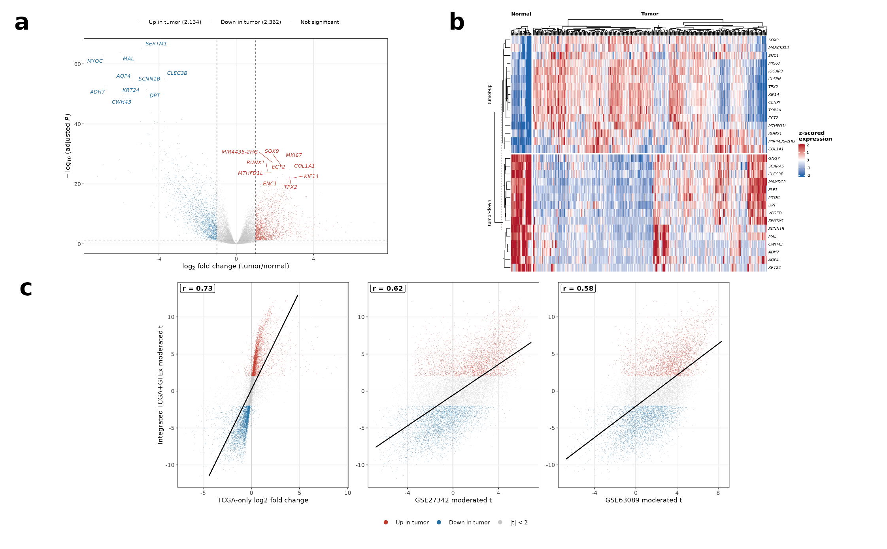

Figure 1. Differential expression between gastric tumors and normal mucosa and its reproducibility.
(a) Volcano plot showing differentially expressed genes in TCGA-STAD. The x-axis represents log2 fold change (log2FC) and the y-axis represents −log10(adjusted P value). Red points indicate significantly upregulated genes, blue points indicate significantly downregulated genes, and grey points represent genes not meeting the significance thresholds of |log2FC| > 1 and adjusted P < 0.05 (2,134 upregulated and 2,362 downregulated of 21,446 tested features).
(b) Heatmap of the 30 most significantly differentially expressed genes, comprising the 15 most upregulated and 15 most downregulated (ranked by adjusted p value, ties broken by absolute log2 fold change then gene symbol). Rows represent genes and columns represent samples. Values are z-scores of expression, so the color scale ranges from low relative expression (blue) to high relative expression (red).
(c) Scatter plots comparing the integrated tumor-versus-normal ranking with three reference rankings. Each point represents one of 12,899 shared genes and the black line denotes a linear fit. The left panel compares against TCGA alone and therefore re-uses the discovery tumors, so it assesses internal consistency rather than replication (r = 0.73); the middle and right panels compare against the independent cohorts GSE27342 (r = 0.62) and GSE63089 (r = 0.58).

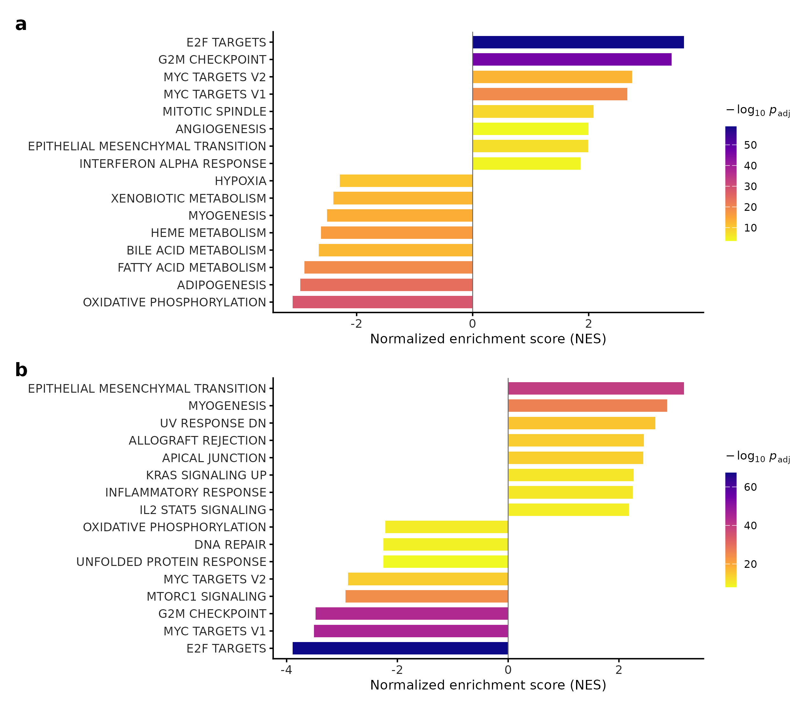

Figure 2. Transcriptional programs distinguishing gastric tumors from normal mucosa and diffuse-type from intestinal-type tumors.
(a) Bar plot showing Hallmark gene-set enrichment analysis (GSEA) results for the tumor-versus-normal comparison. The x-axis represents the normalized enrichment score (NES), which is the enrichment score scaled for gene-set size so that sets of different sizes are directly comparable; a positive NES indicates enrichment in tumors and a negative NES indicates enrichment in normal tissue. Bars are colored by the −log10 adjusted P value, and only gene sets reaching a false-discovery-rate-adjusted P value below 0.05 are shown. Cell-cycle programs (E2F targets, NES 3.75; G2M checkpoint, NES 3.64) and MYC targets (NES 2.67) are enriched in tumors, whereas oxidative phosphorylation (NES −2.54) and fatty-acid metabolism (NES −2.58) are depleted.
(b) Bar plot showing Hallmark GSEA results for the comparison of diffuse-type with intestinal-type tumors as defined by the Lauren classification, a histological scheme that separates gastric cancers into cohesive gland-forming (intestinal) and poorly cohesive infiltrative (diffuse) types. A positive NES indicates enrichment in diffuse tumors. Epithelial–mesenchymal transition (EMT) is the most strongly enriched program (NES 3.17, adjusted P = 1.6 × 10⁻⁴⁰), accompanied by inflammatory, interleukin-6–JAK–STAT3 and tumor-necrosis-factor-α–NF-κB signaling.

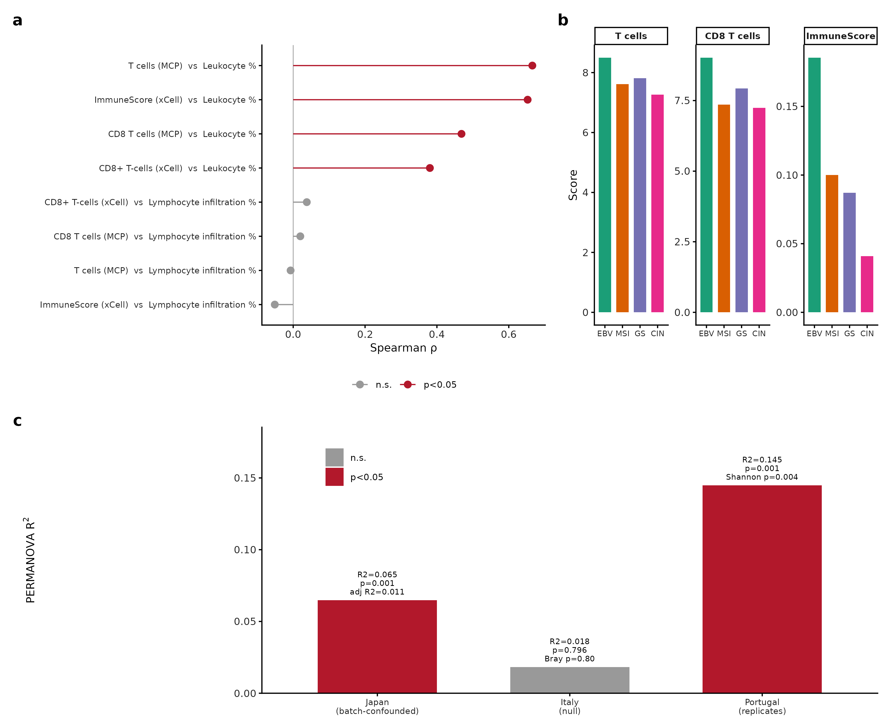

Figure 3. Immune-cell deconvolution and tissue-microbiome comparison.
(a) Lollipop plot showing the Spearman correlation between each computationally deconvolved immune-cell score and the corresponding pathologist-measured value in TCGA-STAD tumors. Points represent correlation coefficients and horizontal segments connect each point to the null value of zero. Filled points denote correlations significant at P < 0.05.
(b) Bar plots showing mean immune-cell scores across the four molecular subtypes defined by The Cancer Genome Atlas: Epstein-Barr virus-positive (EBV), microsatellite-instable (MSI), genomically stable (GS) and chromosomal-instability (CIN). Each facet corresponds to one deconvolution score (CD8 T cells and T cells from MCP-counter; ImmuneScore from xCell) and bars are colored by subtype. EBV-positive tumors carry the highest score on all three measures and chromosomal-instability tumors the lowest, with microsatellite-instable and genomically-stable tumors intermediate and their relative order varying by score. All Kruskal-Wallis tests across subtypes remain significant after Benjamini-Hochberg correction (adjusted P < 1 x 10-6). The Lauren histological classification is not the stratifying variable in this panel.
(c) Bar plot summarizing tumor-versus-control separation of the tissue microbiome in three cohorts. In the Japanese discovery cohort the apparent separation collapses after adjustment for sequencing flowcell (Bray–Curtis R² 0.065 before adjustment, 0.011 after), in the Italian cohort no separation is detected (R² = 0.018, P = 0.80), and in the Portuguese cohort reduced diversity replicates (Shannon P = 0.004; Bray–Curtis R² = 0.145, P = 0.001). These analyses are presented as a cautionary assessment because batch structure and disease status are partially confounded in the discovery cohort.

Figure 4. Prognostic signature coefficients and external validation.
(a) Bar plot showing the LASSO–Cox regression coefficients of the 25 retained genes. A positive coefficient indicates that higher expression is associated with shorter survival and a negative coefficient indicates the opposite.
(b) Forest plot showing hazard ratios for high- versus low-risk groups (median split of the signature score) across validation cohorts, with squares denoting point estimates and horizontal lines denoting 95% confidence intervals: ACRG/GSE62254 1.90 (1.37-2.62), GSE15459 1.68 (1.11-2.54), GSE84437 1.11 (0.84-1.46). Values are from `results/validation_multi/cindex_HR_summary.csv`; the corresponding Kaplan-Meier curves are panels (c)-(f).
(c) Kaplan-Meier curves for high-risk and low-risk groups in the TCGA-STAD training cohort, defined by a median split of the signature score, with the P value from the log-rank test.
(d) Kaplan-Meier curves for the same median-split groups in the Asian Cancer Research Group cohort (GSE62254, n = 300).
(e) Kaplan-Meier curves for the same median-split groups in GSE15459 (n = 191).
(f) Kaplan-Meier curves for the same median-split groups in GSE84437 (n = 431), in which the signature did not separate the two risk groups. This negative result is reported as observed.

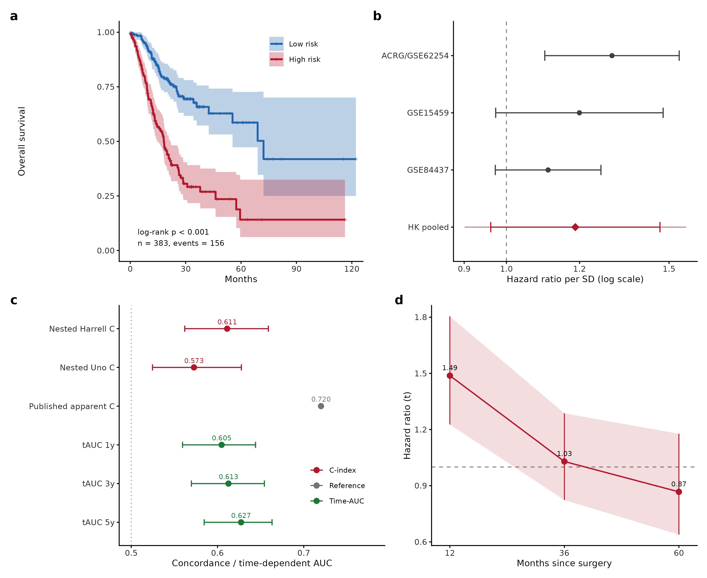

Figure 5. Development and honest evaluation of the 25-gene LASSO–Cox prognostic signature.
(a) Kaplan–Meier survival curves for patients in The Cancer Genome Atlas stomach adenocarcinoma (TCGA-STAD) cohort stratified into high-risk and low-risk groups at the median signature score (n = 383, 156 deaths). The x-axis represents follow-up time in months and the y-axis represents overall survival probability. Shaded bands denote 95% confidence intervals and the P value is from the log-rank test.
(b) Forest plot showing the hazard ratio per one standard deviation increase in signature score in each external validation cohort, adjusted for age and stage, together with the Hartung–Knapp random-effects pooled estimate. Squares represent point estimates, horizontal lines represent 95% confidence intervals, and the diamond represents the pooled estimate (hazard ratio 1.19, 95% confidence interval 0.96–1.47; prediction interval 0.90–1.57). The pooled effect does not reach statistical significance.
(c) Point-and-interval (forest) plot comparing discrimination measured with and without information leakage. The leakage-free estimate is obtained from 20 repeats of 5-fold nested cross-validation, in which gene selection and model fitting occur only inside the training folds (Harrell C = 0.611, 95% confidence interval 0.562–0.659; Uno C = 0.573), whereas the apparent estimate re-uses the same samples for selection and evaluation (C = 0.72). The difference of approximately 0.11 quantifies optimism.
(d) Line plot showing the time-varying hazard ratio for the signature in the Asian Cancer Research Group (ACRG) cohort. The x-axis represents time since surgery in months and the y-axis represents the hazard ratio. The signature is prognostic early (hazard ratio 1.49 at 12 months, 95% confidence interval 1.23–1.80) and attenuates towards the null by 36–60 months, indicating that the proportional-hazards assumption does not hold across the full follow-up period.

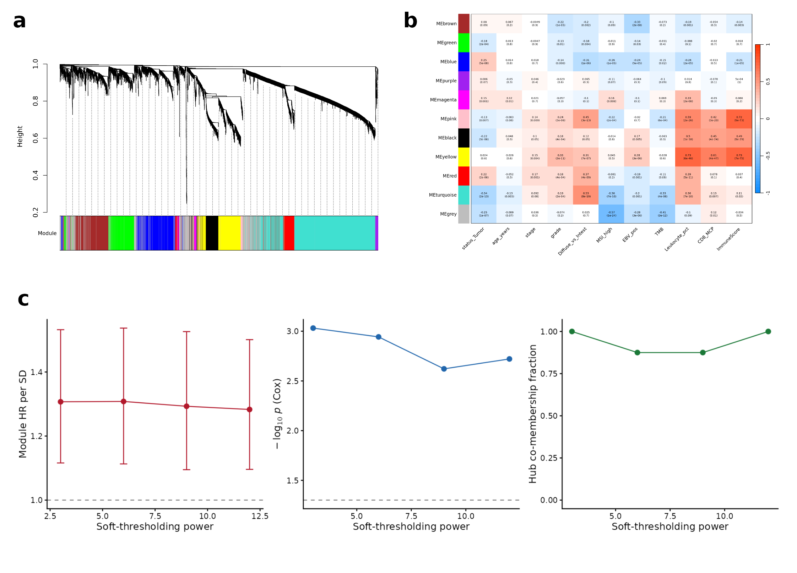

Figure 6. Construction and quality assessment of the gene co-expression network.
(a) Cluster dendrogram showing hierarchical clustering of genes by topological overlap, with the resulting module assignments displayed as colored bars beneath the tree.
(b) Heatmap of correlations between module eigengenes and clinical traits. Rows represent modules and columns represent traits; the color scale ranges from negative (blue) to positive (red) correlation.
(c) Sensitivity of the prognostic module to the soft-thresholding power, shown as three line plots over the candidate powers 3, 6, 9 and 12. The soft-thresholding power raises correlations to a power so that strong correlations are emphasized and weak ones suppressed, approximating the scale-free topology observed in biological networks; because this choice is made by the analyst, its influence on the result is reported here. The left panel plots the hazard ratio per standard deviation of the module eigengene, with vertical bars denoting 95% confidence intervals and the dashed line marking a hazard ratio of one. The middle panel plots the negative base-ten logarithm of the Cox P value, with the dashed line marking P = 0.05. The right panel plots the fraction of the eight module hub genes that remain co-clustered. Across all four powers the hazard ratio stays between 1.28 and 1.31, the Cox P value stays below 0.05 (maximum 0.0024) and hub co-membership stays at or above 0.875, so the prognostic result does not depend on the particular power chosen. Values are given in Supplementary Table S8.

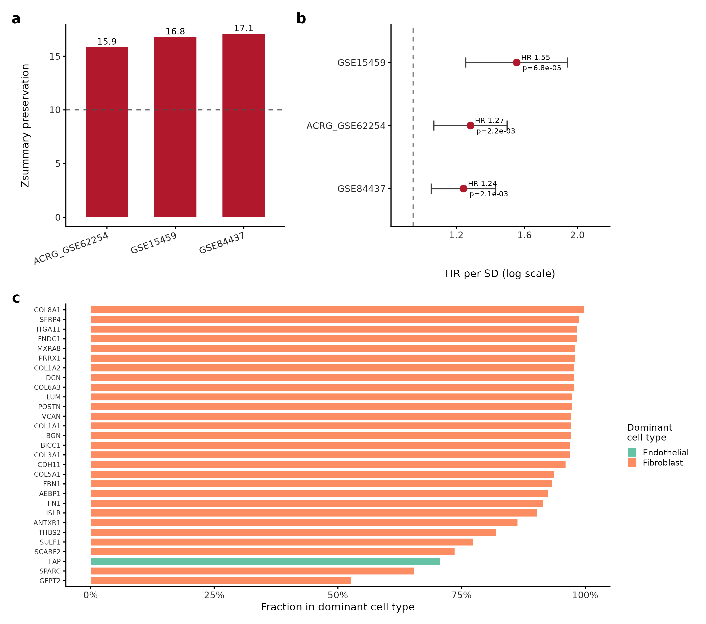

Figure 7. External preservation of the stromal co-expression module, its prognostic value, and its cellular localization.
(a) Bar plot showing preservation of the survival-associated (red) module in three external cohorts, quantified by the WGCNA Zsummary statistic. Zsummary is a permutation-based composite of density and connectivity preservation; the dashed line marks Z = 10, the conventional threshold for strong preservation. All three cohorts exceed it (ACRG/GSE62254 Z = 15.9, GSE15459 Z = 16.8, GSE84437 Z = 17.1), indicating that the module is a reproducible feature of gastric tumor transcriptomes rather than a property of the discovery cohort.
(b) Forest plot showing Cox proportional-hazards results for the module eigengene, defined as the first principal component of the module's expression matrix and therefore a single summary value per patient. Points represent the hazard ratio per one standard deviation of eigengene and horizontal bars represent 95% confidence intervals, plotted on a logarithmic scale. The module is prognostic in all three cohorts (ACRG hazard ratio 1.27, 95% confidence interval 1.09-1.49, P = 0.0022; GSE15459 1.55, 1.25-1.92, P = 6.8 x 10-5; GSE84437 1.24, 1.08-1.42, P = 0.0021), including GSE84437, the cohort in which the 25-gene signature did not validate.
(c) Bar plot showing the single-cell localization of the stromal-module hub genes. For each gene, the bar represents the fraction of its total expression contributed by the cell type in which it is most highly expressed, computed from a public gastric single-cell RNA-sequencing dataset. Bars are colored by that dominant cell type. Twenty-eight of the twenty-nine hub genes are fibroblast-dominant (median fraction 0.97), placing the prognostic program in the fibroblast compartment; FAP is the single exception and is endothelial-dominant in this dataset.

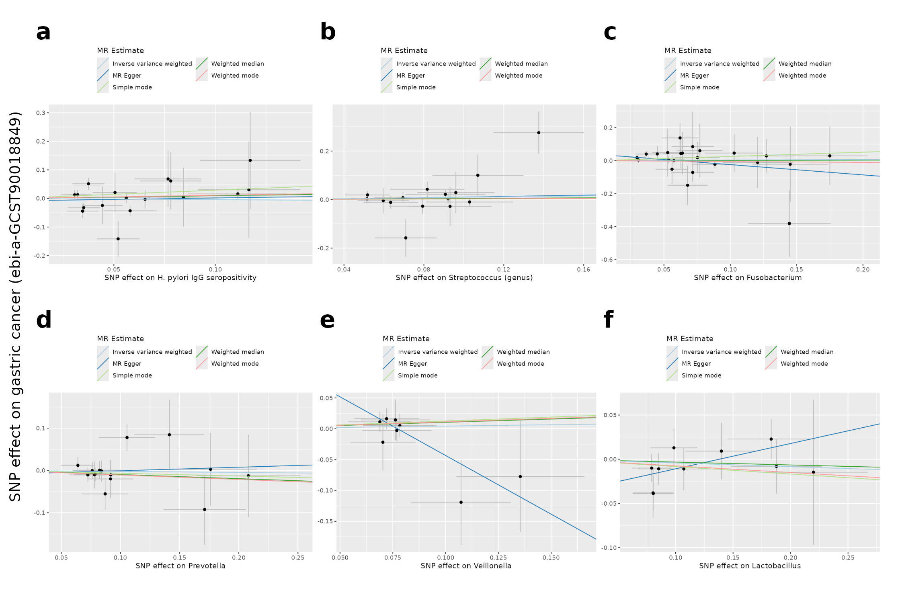

Figure 8. Two-sample Mendelian randomization of microbial exposures on gastric-cancer risk.
Each panel shows the association between single-nucleotide-polymorphism effects on one microbial exposure (x-axis) and the corresponding effects on gastric-cancer risk (y-axis) in a European-ancestry outcome dataset. Each point represents one genetic instrument, with horizontal and vertical bars denoting standard errors. Fitted lines represent the inverse-variance-weighted, MR-Egger, weighted-median, simple-mode and weighted-mode estimators.
(a) Anti-Helicobacter pylori immunoglobulin G seropositivity (17 instruments).
(b) Streptococcus, genus level (15 instruments).
(c) Fusobacterium (23 instruments).
(d) Prevotella (15 instruments).
(e) Veillonella (8 instruments).
(f) Lactobacillus (10 instruments).

# Supplementary Figures

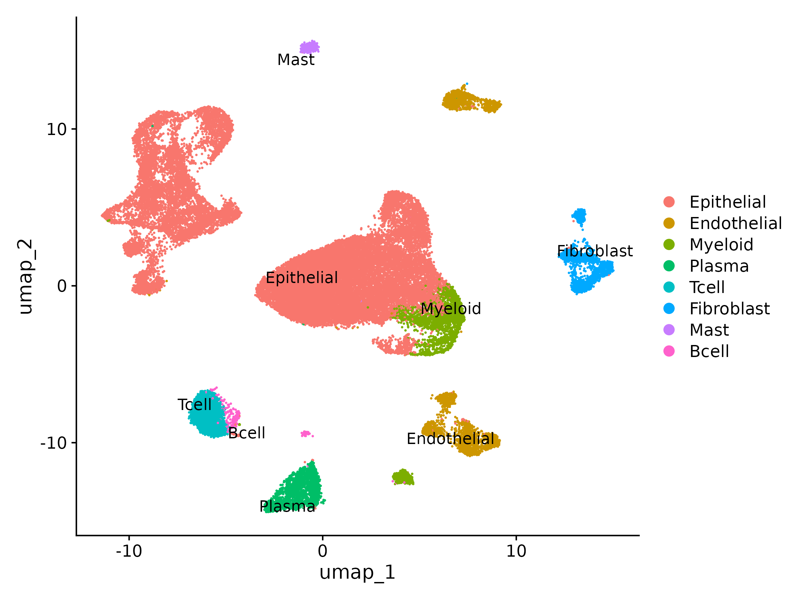

Supplementary Figure S1. Single-cell reference atlas of the gastric premalignant-to-early-cancer cascade.

Uniform manifold approximation and projection (UMAP) of 43,992 cells from the public dataset GSE134520, colored by the eight annotated major cell types. UMAP is a non-linear dimensionality-reduction method in which each point represents one cell and proximity reflects transcriptional similarity; the axes carry no independent units. Cell-type proportions are epithelial 68.6%, endothelial 7.6%, myeloid 6.4%, plasma 5.8%, T cell 5.8%, fibroblast 4.2%, mast 1.0% and B cell 0.6%. This atlas provides the cellular reference used for the module-localization analysis in Figure 7(c).

File: `results/scrna/UMAP_celltypes.png`.

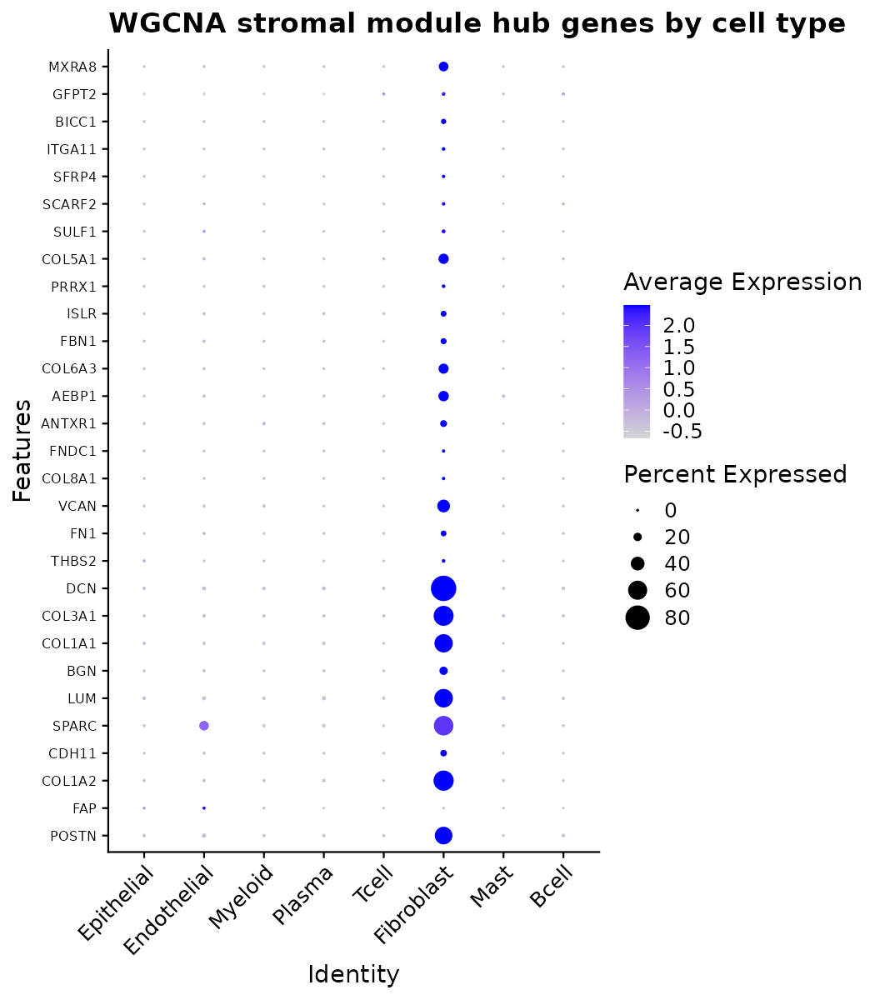

Supplementary Figure S2. Expression of stromal-module hub genes across cell types.

Dot plot of the prognostic co-expression module hub genes across the eight annotated cell types. Dot size represents the fraction of cells in which the gene is detected and dot color represents scaled mean expression. Hub-gene expression is confined to the fibroblast compartment. Because the genes used to annotate the fibroblast cluster could bias this result, the analysis was repeated after removing them; all twenty-three remaining hub genes stayed fibroblast-dominant.

File: `results/scrna/DotPlot_stromal_module_hub.png`.

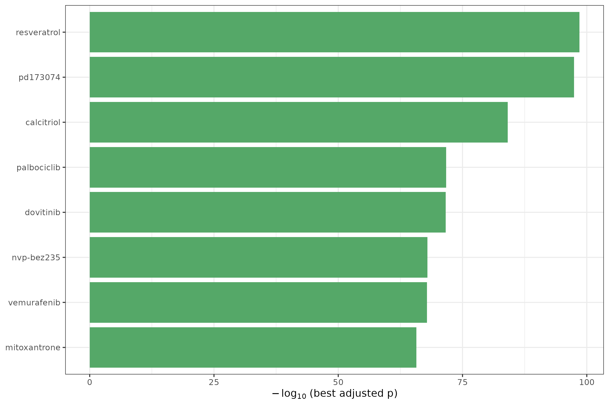

Supplementary Figure S3. Candidate compounds from in-silico drug repurposing.

Bar plot of the eight highest-ranked compounds whose transcriptional perturbation signature reverses the tumor program, from Enrichr queried against the LINCS L1000 and Gene Expression Omnibus drug-perturbation libraries. Bar length is −log10 of the best Benjamini–Hochberg-adjusted enrichment p value across contributing signatures, which is also the ordering criterion. Every compound shown reverses the program on both arms — repressing tumor-up genes and inducing tumor-down genes — so no arm legend is displayed. Four of the eight are targeted kinase inhibitors concordant with a proliferation-dominated program: the fibroblast growth factor receptor (FGFR) inhibitor PD-173074, the cyclin-dependent kinase 4/6 (CDK4/6) inhibitor palbociclib, the FGFR/multikinase inhibitor dovitinib and the phosphoinositide 3-kinase (PI3K)/mechanistic target of rapamycin (mTOR) inhibitor NVP-BEZ235. The remaining four are not kinase inhibitors and include the highest-ranked hit, resveratrol, together with calcitriol, vemurafenib and mitoxantrone; broadly bioactive compounds of this kind recur across LINCS reversal analyses irrespective of tumor type and should be treated as non-specific. These predictions are computational and hypothesis-generating only; no compound was experimentally validated, and because the tumor-up program is proliferation-dominated the nominated agents are broadly anti-proliferative rather than specific to gastric cancer.

File: `results/drug_repurposing_integrated/top_candidate_drugs.png`.

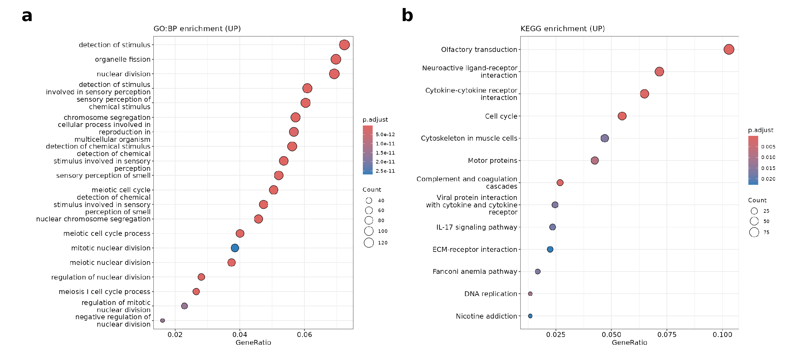

Supplementary Figure S4. Over-representation analysis of tumor-up-regulated genes.

Dot plots of Gene Ontology biological-process and Kyoto Encyclopedia of Genes and Genomes (KEGG) over-representation analysis for the tumor-up gene set. Dot size represents the number of genes in each term and color represents the adjusted P value. Cell-cycle and nuclear-division terms, together with extracellular-matrix-receptor and cytokine terms, dominate. Over-representation analysis depends on an arbitrary significance threshold and is sensitive to gene-family size; the prominent olfactory and sensory-perception terms reflect the large olfactory-receptor gene family rather than tumor biology. The threshold-free gene-set enrichment analysis in Figure 2 is therefore the primary enrichment result, with this panel provided for completeness.

Files: `results/enrichment/dotplot_GO_BP_UP.png`, `results/enrichment/dotplot_KEGG_UP.png`.

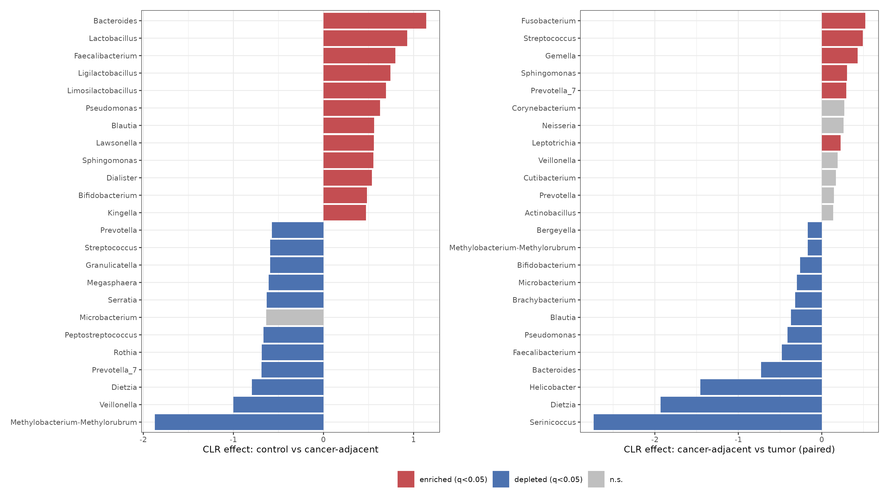

Supplementary Figure S5. Compositional differential abundance of tissue microbiota.

Bar plots of centered-log-ratio effect sizes for the two discovery-cohort contrasts, tested by Wilcoxon rank-sum with Benjamini-Hochberg correction. The centered-log-ratio transform is used because sequencing yields relative rather than absolute abundances, so raw proportions are not independent. The left panel shows control versus cancer-adjacent mucosa (44 of 61 genera at q < 0.05) and the right panel the paired cancer-adjacent versus tumor contrast (18 of 61 genera at q < 0.05). Bars are colored by direction where q < 0.05, with red indicating enrichment and blue depletion, and the twelve most enriched and depleted genera are shown per panel. These genus-level shifts are reported for completeness only; as detailed in the Results, the tumor contrast is confounded with sequencing batch and does not replicate in an independent batch-clean cohort, so these taxa are not proposed as biomarkers.

Files: `results/microbiome_biomarker/04a_DA_control_vs_GCN.csv`, `04b_DA_GCN_vs_GCT_paired.csv`.

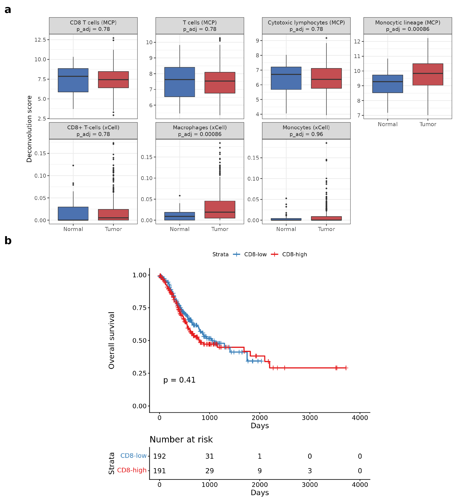

Supplementary Figure S6. Immune-compartment shifts and CD8 T-cell survival association.

(a) Comparison of immune compartments between tumor and normal tissue. Enrichment is dominated by the macrophage and monocyte lineage, with no net gain in CD8-positive T cells.

(b) Association between CD8-positive T-cell score and overall survival. The score is not prognostic in this cohort (Cox hazard ratio 1.04, P = 0.41); this null result is reported as observed.

Files: `results/plots/Immune_*.png`.

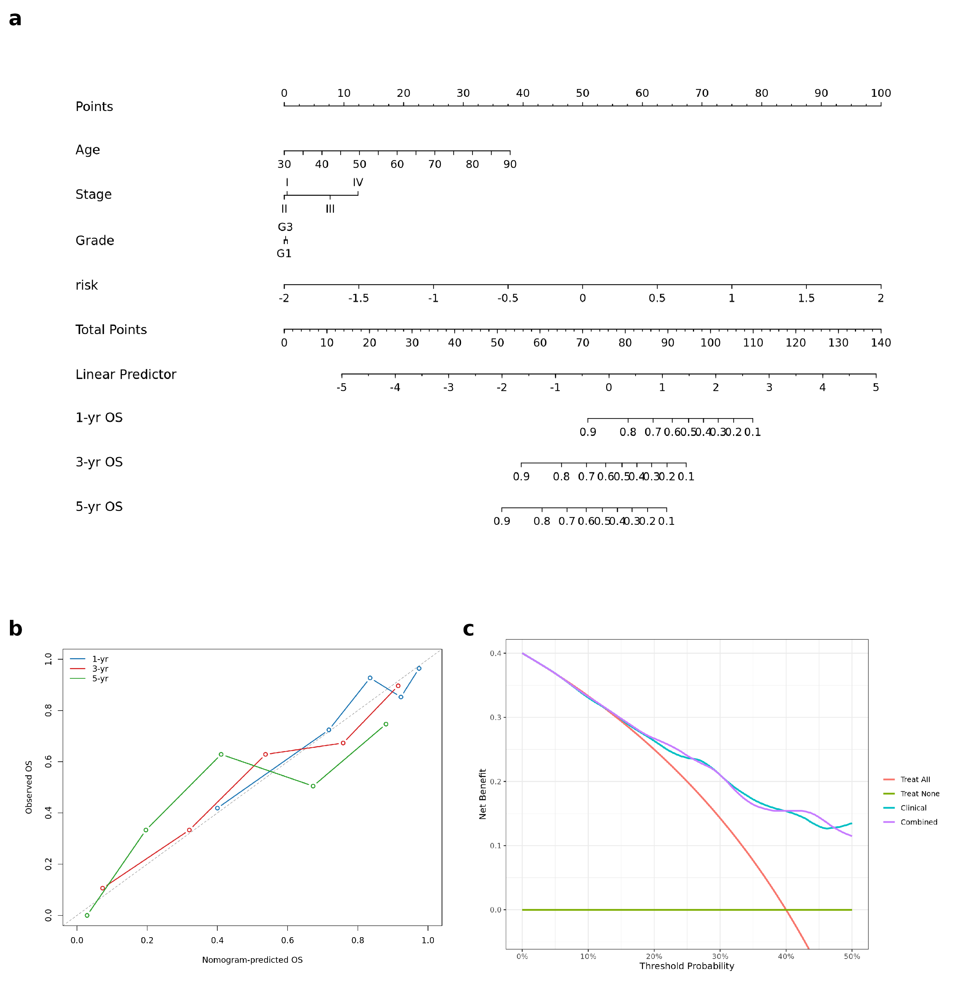

Supplementary Figure S7. Clinical nomogram, calibration, and external decision-curve analysis.

(a) Nomogram combining clinical covariates with the signature score for prediction of 1-, 3- and 5-year overall survival. A nomogram converts each predictor into points on a common scale whose total maps to a predicted survival probability.

(b) Calibration plots at 1, 3 and 5 years, computed in the development cohort. Calibration compares predicted against observed survival; the diagonal represents perfect agreement.

(c) Decision-curve analysis performed out-of-sample in the Asian Cancer Research Group cohort. Decision-curve analysis plots net benefit against the threshold probability at which a clinician would act. Both the clinical model and the combined model carry net benefit relative to treat-all and treat-none strategies, but their curves are essentially superimposed across the 5-40% threshold range, indicating that adding the signature confers no incremental net benefit over standard staging. The nomogram is presented as an illustrative research tool, not as a validated decision instrument.

Files: `results/nomogram_combined/`, `results/external_utility_ACRG/DCA_external.png`.

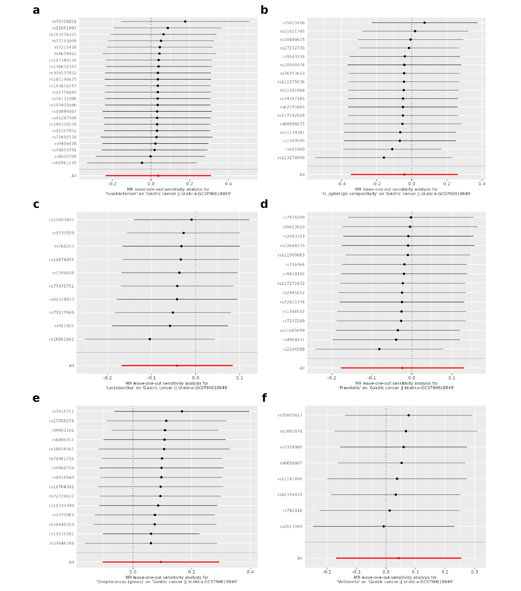

Supplementary Figure S8. Mendelian-randomization leave-one-out analysis for all six exposures.

Leave-one-out inverse-variance-weighted estimates for each of the six microbial exposures. Removing any single instrument leaves every pooled estimate straddling the null, confirming that no individual instrument drives any result and that the overall null is not an outlier artefact.

Files: `results/mr_real/loo_*.png`.

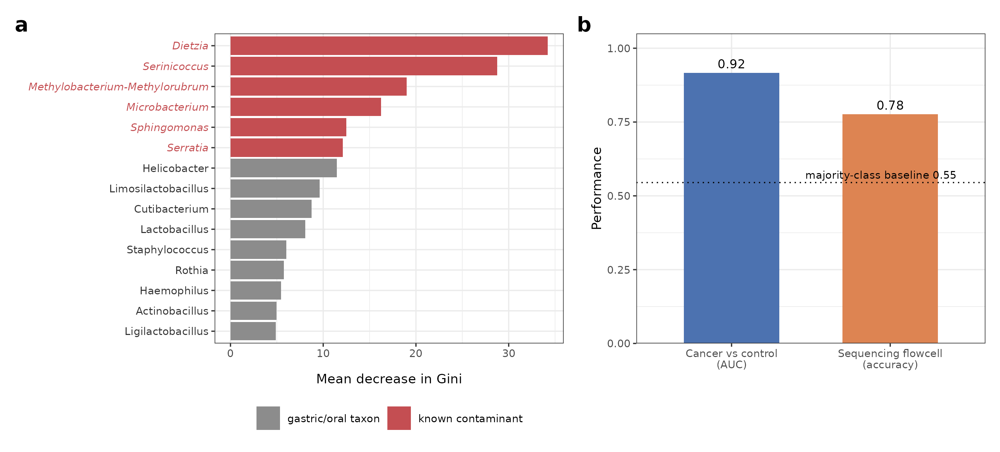

Supplementary Figure S9. Evidence that the tumor-microbiome classifier reflects sequencing batch.

(a) Bar plot of the fifteen genera ranked highest by mean decrease in Gini importance in the cancer-versus-control random-forest classifier. Genera shown in red italic type are recognized environmental or reagent contaminants (Dietzia, Serinicoccus, Methylobacterium-Methylorubrum, Microbacterium, Sphingomonas and Serratia) rather than gastric or oral commensals, and they dominate the classifier.

(b) Comparison of the classifier's apparent discrimination with its ability to predict sequencing batch. The cancer-versus-control area under the receiver operating characteristic curve is 0.92 (95% confidence interval 0.90-0.94), but the same feature space predicts the sequencing flowcell among biologically similar samples at 78% accuracy against a 55% majority-class baseline (dotted line). The apparent tumor signal therefore tracks sequencing batch rather than tumor biology.

Files: `results/microbiome_biomarker/05_rf_importance.csv`, `05_rf_metrics_and_batch_sanity.csv`.
